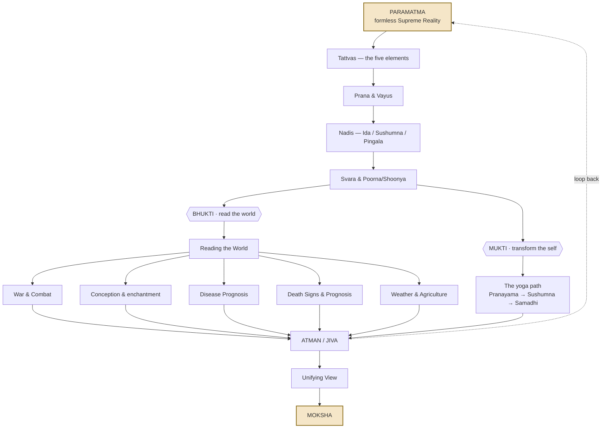

# Shiv Swarodaya — Overview

A layered map of the complete 396-verse system. This page is the **hub**: each numbered box below links to a small, readable detail file. Nothing is lost — the detail lives in the linked pages.

> Click a box to jump to its detail file.

> Dashed / `[claim]` items = traditional scriptural claims, not empirical facts.

## Index

### **The spine**
1. [Tattvas — the five elements](01-tattvas.md)
2. [Prana & Vayus](02-prana-vayus.md)
3. [Nadis — Ida / Sushumna / Pingala](03-nadis.md)
4. [Svara & Poorna/Shoonya](04-svara.md)

### **Bhukti — reading the world (prediction)**

5. [Reading the World](05-bhukti-reading-the-world.md)
6. [War & Combat](06-bhukti-combat.md)
7. [Conception & enchantment](07-bhukti-conception.md)
8. [Disease Prognosis](08-bhukti-disease-prognosis.md)
9. [Death Signs & Prognosis](09-bhukti-lifespan-prognosis.md)
10. [Weather & Agriculture](10-bhukti-weather-agriculture.md)

### **Mukti — transforming the self (yoga)**

11. [The yoga path](11-mukti-yoga.md)

### **Unifying**

12. [Unifying View](12-unifying-view.md)

## The one assumption under everything

> COSMIC ↕ ELEMENTAL ↕ PRANIC ↕ NADI ↕ SVARA ↕ OBSERVABLE STATE
>
> What happens in the cosmos is legible in the breath — and the breath, once mastered, changes one's relation to the cosmos.
