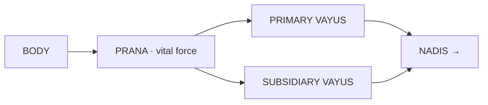

# Prana & Vayus

[↩ Back to overview](00-overview.md)

> 📖 Verses 43–48, 220–228

**Prana** (vital force or life-breath) is the text's central mechanism — the link between cosmic elements and the living body. Where the tattvas are principles, prana is the energy that animates them in bodily form. The text describes prana as having **ten functional divisions** called vayus (winds), each governing specific physiological processes `§43-48`.

## The ten vayus

Prana divides into **five primary vayus** and **five subsidiary vayus** `§43-48`. The primary vayus govern major life functions and have specific seats in the body. The subsidiary vayus handle specific reflexes and processes:

**Five primary vayus** (with their seats):

| Vayu | Seat / region |
|---|---|
| **Prana** | heart |
| **Apana** | anus / lower region |
| **Samana** | navel |
| **Udana** | throat |
| **Vyana** | pervades whole body |

**Five subsidiary vayus** (with their functions):

| Vayu | Function |
|---|---|
| **Naga** | belching / vomiting |
| **Kurma** | blinking / eye movement |
| **Krikara** | sneezing |
| **Devadatta** | yawning |
| **Dhananjaya** | pervades body / remains after death |

The term "prana" appears twice here — once as the name of the entire vital force, and once as the name of the specific primary vayu seated in the heart. This layered usage runs through the text.

## Two directions of flow

The text treats prana as having **two possible directions of operation**, corresponding to the two halves of the system — bhukti (worldly engagement) and mukti (liberation):

- **Outward (ordinary life):** Tattvas → Prana → Vayus → Nadis → Svara → life, body, action, health, lifespan. The natural flow sustains the embodied state.
- **Inward (yoga):** Conscious prana control → pranayama → nadi control → Sushumna → samadhi → transcendence of death. The practitioner reverses the flow. *(Detailed in [Yoga path](11-mukti-yoga.md).)*

Everything in the bhukti sections (prediction, war, disease, death) assumes the outward flow. Everything in the mukti section assumes mastery of the inward flow.

## The science of prana-length

The text gives a detailed **prana-angula science** — the measurement of breath-length in units called angula (finger-widths) and its relationship to lifespan and yogic attainments `§222-228`.

### Observation 1: Natural breath-length varies by activity

The text first describes how breath-length **naturally increases** with physical activity `§222-224`. The measurements refer to **exhalation length** (except where inhale/exhale are distinguished at rest):

| State | Breath length (angula) |
|---|---|
| Rest (inhale) | 10 |
| Rest (exhale) | 12 |
| Eating / vomiting | 18 |
| Walking | 24 |
| Running | 42 |
| Sexual intercourse | 65 |
| Deep sleep | 100 |

The text states "normally twelve angulas" `§224`, which matches the exhalation length at rest. The more intense the activity, the longer the exhalation. During deep sleep, breath reaches 100 angula — its maximum natural length.

> ⚠️ **Note on two measurement systems:** 
> The text presents two independent breath-length frameworks without explicitly reconciling them. In [Tattvas](01-tattvas.md), each element has a characteristic breath-length (Fire = 4, Air = 8, Earth = 12, Water = 16 angula) `§159`. Here, activity determines breath-length (rest = 12, walking = 24, running = 42 angula). The text doesn't state whether these interact (e.g., "Earth tattva while walking = ?") or whether they measure different contexts (meditative observation vs. daily activity). Readers must hold both systems as parallel observation frameworks.

### Observation 2: Yogic reduction of breath-length grants powers

The text then describes a **yogic practice**: deliberately **reducing** the natural breath-length through pranayama discipline `§225-228`. "Length" here means the **physical distance breath travels outward from the nostrils** when exhaling. Normal exhalation extends 12 angula (finger-widths) from the nose; through yogic control, the practitioner makes the breath subtler and more refined so it projects less distance outward. Each level of reduction is said to unlock a specific attainment `[claim]`:

| Reduce breath by | Attainment |
|---|---|
| −1 angula | desirelessness |
| −2 angula | bliss |
| −3 angula | sexual power |
| −4 angula | words come true (speech-siddhi) |
| −5 angula | clairvoyance (see anywhere) |
| −6 angula | levitation |
| −7 angula | great speed |
| −8 angula | 8 siddhis (supernatural powers) |
| −9 angula | 9 nidhis (kinds of wealth) |
| −10 angula | 10 forms (shapeshifting) |
| −11 angula | shadowlessness |
| −12 angula | Hansa state (nectar of Ganga) |

At the final level (−12 angula), the text states the body becomes filled entirely with prana, eliminating the need for food or drink `§228` `[claim]`.

### The core principle

The underlying claim is: **shorter breath = longer life** `§228` `[claim]`. By consciously reducing the natural breath-length through yogic discipline, the practitioner is said to extend lifespan and unlock specific powers at each level. The practice reverses the natural pattern — where activity lengthens breath, the yogi shortens it deliberately to gain mastery over prana.

This breath-shortening practice connects directly to the pranayama methods described in [Yoga path](11-mukti-yoga.md).

## Why the prana-vayus matter

Prana is what makes the tattvas observable. Where [Tattvas](01-tattvas.md) are cosmic principles, prana is the measurable energy that flows through the body and makes itself visible as breath. The text repeatedly states that you cannot observe an element directly — you observe its effect on breath-length, breath-temperature, breath-direction. This is why the angula science appears here: it's the ruler that measures what would otherwise be invisible.

The ten vayus show up everywhere in the predictive system: disease prognosis depends on irregular vayu flow `§316-326` ([Disease](08-bhukti-disease-prognosis.md)), death signs include the failure of specific vayus `§327-374` ([Death](09-bhukti-lifespan-prognosis.md)), and the entire yoga path is the deliberate redirection of prana from outward (life-sustaining) to inward (liberation-seeking) flow. When you read about pranayama in [Yoga path](11-mukti-yoga.md), you're reading about the conscious manipulation of what this page describes as natural function.

This is the mechanism layer — the energy system that sits between cosmic elements and the observable interface of breath.

---

⏮ [Prev: Tattvas](01-tattvas.md)  ·  ↩ [Overview](00-overview.md)  ·  📖 [Glossary](glossary.md)  ·  [Next: Nadis](03-nadis.md) ⏭