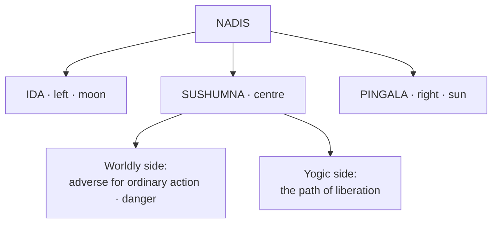

# Nadis — Ida / Sushumna / Pingala

[↩ Back to overview](00-overview.md)

> 📖 Verses 32–71

**Nadis** are the channels through which prana flows in the subtle body. The text states there are approximately 72,000 nadis in all, running from the navel to the shoulders around the spine `§33`, but three of them carry primary importance: **Ida** (left), **Pingala** (right), and **Sushumna** (centre) `§32-42`.

These three nadis are the infrastructure of the entire system. Ida and Pingala are the channels of ordinary dual existence — lunar and solar, receptive and forceful, feminine and masculine. Sushumna is the central channel, inactive in ordinary life but essential for yogic practice.

## Ida and Pingala — a complementary polarity

The text describes Ida and Pingala as a **complementary polarity**, each governing different qualities, directions, activities, and outcomes `§53, 60-61, 76-99`:

| | **IDA / Lunar** | **PINGALA / Solar** |
|---|---|---|
| Side | left | right |
| Nature | receptive · cooling · nourishing | active · heating · forceful |
| Colour `§61` | white | black |
| Parity `§60` | even | odd |
| Presiding deity `§53` | Shakti / Goddess | Shiva |
| Directions `§76` | East & North | West & South |
| Best for | leaving the house `§60`, long journeys `§99` | entering / returning `§60`, nearby travel |
| Favours | journeys, acquisition, nourishment, compromise | confrontation, battle, hard tasks |
| War | defender wins | attacker wins |
| Polarity | feminine / lunar | masculine / solar |

**Neither nadi is simply "good" or "bad."** The suitability of Ida or Pingala depends on the activity, timing, tattva, direction, question, role, and context `[claim]`. The same nadi that favors one action may hinder another. Pingala also drives the male side of the sexual and conception polarity (detailed in [Conception](07-bhukti-conception.md)), where Ida and Pingala participate in male/female svara combinations.

## Sushumna — the dual role

**Sushumna** occupies the centre, a transitional or middle state that is neither ordinary lunar nor solar dominance. The text assigns it a **double significance** that appears paradoxical:

- **For worldly goals:** Sushumna is unsuitable and often described as dangerous for prediction and ordinary action.
- **For spiritual goals:** Sushumna is the *central* channel — pranayama leads to kumbhaka (breath retention), which activates Sushumna, opening the path to samadhi and transcendence of death.

This is one of the system's **open tensions** — Sushumna is described as "cruel for worldly acts" and simultaneously "essential for yoga" `[claim]`. The resolution likely lies in the objective: what is adverse for action-in-the-world is precisely what opens the path beyond the world. (See [Unifying view](12-unifying-view.md) for further discussion.)

## Direction and travel rules

The text gives specific **directional correspondences** for Ida and Pingala, and warns against traveling in directions that oppose the active svara `§76-78`:

- **Moon (Ida)** governs **East & North**
- **Sun (Pingala)** governs **West & South**

The rule: **do not travel West or South while Solar (Pingala) flows; do not travel North or East while Lunar (Ida) flows** `[claim]`. Traveling against the svara-direction is said to risk peril, failure to return, or death.

## The ten primary nadis

Of the approximately 72,000 nadis, the text focuses on **ten primary nadis** that carry the ten vayus and open into specific body locations `§34-42`. The kundalini sits coiled like a serpent with ten nadis above it and ten below `§34`; of the twenty-four nadis total, ten are named:

| Nadi | Seat / body-opening |
|---|---|
| **Ida** | left (of spine) |
| **Pingala** | right |
| **Sushumna** | centre (pranic passage) |
| Gandhari | left eye |
| Hastijivha | right eye |
| Poosha | right ear |
| Yashashwini | left ear |
| Alambusha | mouth |
| Kuhu | genitals |
| Shankhini | anus |

These nadis reside in the **subtle body** and are seated in the ten body-openings listed `§41-42`. The three principal nadis — Ida, Pingala, and Sushumna — form the backbone of the entire breath-based system.

## Why the nadis matter

Nadis are the infrastructure that connects [Prana](02-prana-vayus.md) to [Svara](04-svara.md) — the channels through which vital force travels before becoming observable as breath. Without understanding the three primary nadis, the entire predictive system makes no sense: when the text says "moon flows" or "sun flows," it means prana is moving through Ida or Pingala. When it says "check which side is active," it's asking you to observe which nadi is dominant.

Every prediction rule in [Bhukti Engine](05-bhukti-reading-the-world.md) assumes you know whether Ida or Pingala is active. The direction rules in [War](06-bhukti-combat.md) depend on nadi-direction correspondence. The entire [Yoga path](11-mukti-yoga.md) is the practice of shifting prana from Ida/Pingala (duality, embodiment, worldly life) into Sushumna (unity, transcendence, liberation).

This is the routing layer — the channel network that carries prana from its source to the observable interface of breath.
