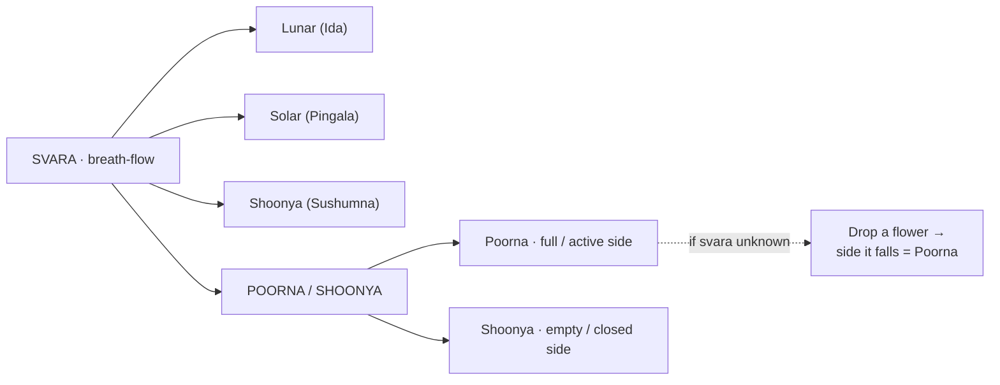

# Svara & Poorna/Shoonya

[↩ Back to overview](00-overview.md)

> 📖 Verses 49–71, 135, 266–267

**Svara** means "breath-flow" or "current" — the observable interface through which the practitioner reads the entire system. While the tattvas are principles, the vayus are energies, and the nadis are channels, the svara is what can be directly **observed** and **measured** at any given moment `§49-71`.

The svara flows through one of three nadis — **Lunar (Ida)**, **Solar (Pingala)**, or **Shoonya (Sushumna)** — and within each nadi, the breath may be **Poorna** (active/full on one side) or **Shoonya** (empty/closed on the opposite side). The combination of nadi, side, tattva, time, and context determines the reading.

## Poorna and Shoonya — active and inactive

**Poorna** (full, active) and **Shoonya** (empty, void) describe a **secondary polarity** within the breath-flow, layered on top of the Ida/Pingala distinction `§135, 266-267`. 

In practical terms: **Poorna is whichever nostril has stronger breath-flow at the moment.** Shoonya is the opposite nostril with weaker or no flow.

- **Poorna** = the active side where breath flows strongly. You can feel the air moving distinctly through this nostril. In predictive contexts, it generally indicates success, presence, strength, and completion `[claim]`.
- **Shoonya** = the closed or weak side where breath flow is minimal or absent. Less air (or no air) passes through this nostril. It generally indicates failure, absence, weakness, and incompleteness `[claim]`.

**How to observe:** The text gives two methods `§135, 267`:
1. **Direct sensing**: Close your eyes and focus on your nostrils. Which side has stronger airflow? That's Poorna.
2. **Flower test**: If you're uncertain, hold a flower near your nose and drop it — the side it falls toward is Poorna.

The text also describes directional qualities of Poorna breath `§135`: for Lunar (Ida), Poorna breath flows "front, upwards, and right"; for Solar (Pingala), it flows "down, backward, and right." Otherwise the svara is considered Shoonya (empty).

**Neither Poorna nor Shoonya is universally good or bad.** The meaning depends on the context — the type of question, the activity, the tattva, the nadi, the position of the questioner, and the timing. The same polarity that favors one action may hinder another.

## The variable stack — how a moment is read

To interpret any moment in the system, the practitioner must **stack multiple variables**:

> **Which nadi is active? · Which side is Poorna? · Which tattva is flowing? · What time is it? · What direction? · Who is asking? · What is being asked? · What action is intended?**

No single variable determines the outcome — it is the **intersection** of all variables that produces the final interpretation.

Here's an example reading for a question about a journey:

| Variable | Observed value | Why it matters |
|---|---|---|
| **Active nadi** | Ida (Lunar) | Favorable for journeys, especially East/North |
| **Poorna/Shoonya** | Poorna on left | Active side indicates success |
| **Tattva** | Water | Favorable, grants immediate success |
| **Time** | 10 AM (lunar hour) | Aligns with Ida dominance |
| **Direction** | East | Matches Ida's favored direction |
| **Questioner position** | Approaching from left | Auspicious during lunar flow |
| **Day/paksha** | Shukla paksha (waxing) | Lunar favorable period |
| **Question type** | Journey/travel | Best during Ida/lunar |

**Combined reading**: All variables align favorably → the journey is auspicious `[claim]`.

If even one variable were reversed (e.g., Pingala active instead of Ida, or Shoonya instead of Poorna), the interpretation would shift. This is why the text repeatedly emphasizes observing **all the conditions** before making a determination.

This variable stack feeds into both wings of the system: the **bhukti** (worldly prediction) methods detailed in [Prediction engine](05-bhukti-reading-the-world.md), and the **mukti** (liberation) practices detailed in [Yoga path](11-mukti-yoga.md).

## Why svara matters

Svara is what makes the entire system **actionable**. All the theory — tattvas, prana, nadis — remains abstract until you can observe the svara. The text doesn't ask you to visualize subtle channels or sense inner energies; it asks you to **check which nostril is breathing** and read the pattern.

Every prediction method in the bhukti chapters depends on observing the svara at the moment the question is asked. [War outcomes](06-bhukti-combat.md) depend on which svara is active when the armies meet. [Disease prognosis](08-bhukti-disease-prognosis.md) depends on observing irregular svara patterns. [Conception predictions](07-bhukti-conception.md) depend on which partner's svara is dominant during union. Without the ability to read svara, the entire predictive engine is unusable.

The yoga path works in reverse — instead of passively observing which svara flows, the practitioner learns to **control** the svara through pranayama, deliberately shifting prana from Ida/Pingala into Sushumna. What begins as observation becomes intervention.

This is the observable interface — the single point where the entire system becomes readable and, eventually, controllable.
