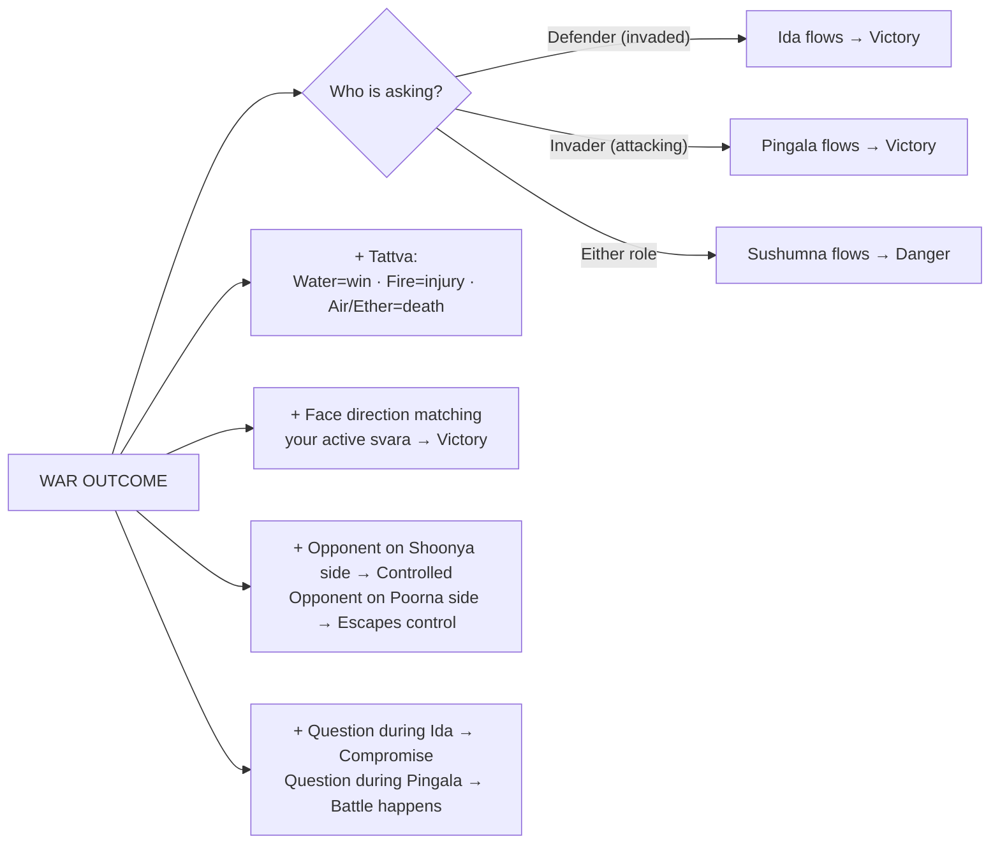

# War & Combat

[↩ Back to overview](00-overview.md)

> 📖 Verses 231–272

The war domain `§231-272` is the **fullest application of the prediction engine** in the text. War is not treated as a standalone topic but as the context where every variable in the system — svara, tattva, direction, position, role, question, and timing — is stacked together to produce a specific outcome.

The text gives rules for reading battle outcomes based on which nadi is active, the tattva flowing, the direction faced, the position of the opponent, and the role of the person (holder or challenger). The complexity here demonstrates the system's layered logic in action.

> 💡 **Modern application note:** While the text uses battlefield warfare as its primary example, the underlying logic applies to any **competitive or confrontational scenario** where there is positional asymmetry (defender vs challenger), timing strategy (when to engage), and tactical positioning. Contemporary readers may find these principles relevant to: job interviews (you enter their territory = "invader"), negotiations (holder vs challenger roles), competitive exams (timing your peak mental state), court proceedings (defendant vs prosecutor), sports matches (home vs away advantage), or business pitches (incumbent vs disruptor positioning). The variables — timing, role, direction, position, and breath-state — remain constant across contexts.

## Role and svara — holder versus challenger

The text assigns different favorable svaras to different **positional roles** `§255, 258-260` `[claim]`:

- **Defender (the holder):** Victory comes when **Ida (lunar svara)** flows. The one defending their position, territory, or status wins during lunar flow.
- **Invader (the challenger):** Victory comes when **Pingala (solar svara)** flows. The one initiating challenge, entering new territory, or attacking the status quo wins during solar flow.
- **Sushumna:** Grave danger for both sides `§256`. Avoid engagement during Sushumna flow.

This creates a strategic asymmetry: the same confrontation can favor different sides depending on timing. If the defender's Ida flows at the moment of engagement, they have the advantage. If the challenger's Pingala flows, they have the advantage.

**Practical application `§258-260`:** The defender (invaded king in the text's language) waits for Ida to flow before engaging. The challenger (invading general) times the initiative for when Pingala flows. If Sushumna flows during confrontation, both sides face extreme danger regardless of role.

**Contemporary parallel:** In a job interview, you (the candidate) are the "invader" entering the company's territory — Pingala flowing during the interview may favor your bold presentation. In a court case, the defendant is the "defender" — Ida flowing may favor their position of innocence.

## Direction rules — face your active svara's direction

The text states: **face the direction that corresponds to your active svara when fighting** `§257` `[claim]`.

Recall from [Nadis](03-nadis.md):
- **Ida (lunar)** governs **East & North**
- **Pingala (solar)** governs **West & South**

**Application:** If Ida flows, face East or North during engagement. If Pingala flows, face West or South. Engaging while facing your active svara's direction ensures victory `§257`. The text says "there is no need to think otherwise" — this is treated as a deterministic rule.

## Position — opponent on Poorna versus Shoonya side

The position of the opponent relative to your **Poorna** (active nostril) versus **Shoonya** (closed nostril) side determines the outcome `§238, 262` `[claim]`:

| Opponent position | Outcome |
|---|---|
| Opponent on your **Shoonya side** (closed nostril side) | Controlled / captured (text: "killed") |
| Opponent on your **Poorna side** (active nostril side) | Escapes / avoids control (text: "escapes battlefield") |
| Your side on Poorna, opponent on Shoonya | Your victory is assured |

**Practical application:** Position yourself so the opponent stands on your Shoonya (closed nostril) side. This can be done by physical positioning (literally sitting or standing so they're on your closed-nostril side) or by deliberately switching which svara flows using breath control techniques. The text describes practitioners who manipulate their own svara to ensure the opponent is always on the Shoonya side `§238, 262`.

**Modern example:** In a negotiation or interview, if your left nostril (Ida) is active and strong (Poorna), position yourself so the other person sits to your right (your Shoonya side). According to the text's logic, this positioning favors your control of the interaction.

## Tattva determines outcome and risk level

Each tattva carries a specific **outcome tendency** and predicts the **location of injury** if wounds occur in physical confrontation `§253-254, 265` `[claim]`:

| Tattva | Outcome tendency | Physical risk indicator |
|---|---|---|
| **Earth** | relatively balanced result for both sides | stomach region |
| **Water** | victory assured | foot/lower body |
| **Fire** | loss of body part / serious injury | thigh/mid-body |
| **Air** | death / extreme danger | hand/upper body |
| **Ether** | death / extreme danger | head |

These outcomes are not absolute — they combine with svara, direction, role, and position to produce the final prediction. Earth is neutral, Water strongly favorable, Fire risky (injury but survivable), and Air/Ether life-threatening. The text advises avoiding confrontation entirely during Air or Ether dominance `§241, 265`.

**Contemporary reading:** Even if not in physical danger, the tattva indicates the **severity level** of the confrontation. Water = safe to engage fully. Fire = expect significant cost or loss. Air/Ether = avoid the confrontation if possible; outcomes may be catastrophic.

## Question rules — timing reveals intention

When a **question about confrontation or competition** is asked (whether about battle, a deal, a challenge, or any decisive engagement), the timing and svara-state at the moment of asking determine the answer `§261, 263-264` `[claim]`:

**Poorna versus Shoonya timing:**
- If two people ask about confrontation during **Poorna** (active) flow: **first asker wins**, second loses `§261`.
- If two people ask during **Shoonya** (closed) flow: **first asker loses**, second wins `§261`.

**Svara indicates intention:**
- Question asked during **Ida** flow → compromise/peace likely `§264`
- Question asked during **Pingala** flow → confrontation will happen `§264`

**Letter parity (from [Reading the World](05-bhukti-reading-the-world.md)):**
- Count the letters in the question. **Even total = success**; **odd total = defeat** `§263`.

These rules are used for prashna (question divination) — someone arrives asking about a competitive situation, you observe which svara is flowing and count the letters to give the answer. This applies equally whether the question is "Should we go to war?", "Should I take this job?", or "Will this negotiation succeed?"

## Tactical techniques — active manipulation

The text gives specific **physical techniques** for those who know svara science `§236-246, 251`. While described in battlefield language, these are fundamentally **breath control and positioning tactics** applicable to any high-stakes moment `[claim]`:

**Dominant-side alignment:** Use the **hand/side that matches your active svara** for key actions `§236`. If left nostril (Ida) flows, lead with left hand/side. If right nostril (Pingala) flows, lead with right hand/side. (Text specifies: hold weapon on active svara side.)

**Breath retention (Kumbhaka):** Draw prana in and **hold the breath** while entering a critical moment — mounting a vehicle, beginning an engagement, or taking any decisive action `§237, 249, 268`. This is said to grant success and mental stability in all activities `[claim]`.

**Contemporary application:** Breath retention before a presentation, exam, or negotiation can stabilize your nervous system and align your energy. The principle is: controlled breath = controlled outcome.

**Protecting the active svara:** Inhale through the **closed nostril** (Shoonya side) to protect and preserve the **active svara** (Poorna side) `§251`. The text warns that engaging without this technique risks injury.

**Advanced techniques (from the text):** The verses also describe drawing prana from the active svara side up to the ear while Air element flows (said to make one "unconquerable" `§242-243`), performing Sarpa Mudra (serpent gesture) before engagement `§240`, and stepping forward with the foot that corresponds to the active svara side when beginning a journey `§239`. These highly specific techniques reflect the text's battlefield context.

These techniques show the text is not purely divinatory — it describes **active manipulation** of the system for tactical advantage. The most universally applicable principle is breath retention (kumbhaka) before decisive moments, which modern practitioners can use regardless of context.

## Why war matters

War (understood as any **competitive confrontation**) demonstrates the prediction engine at **maximum complexity**. Every variable taught in the foundation — svara, tattva, direction, position, time, role, question — must be observed and stacked simultaneously. No single variable determines the outcome; it's the intersection of all factors.

This domain also reveals something deeper: the text is teaching **operational control**, not just observation. The practitioner doesn't passively accept which svara flows — they learn to switch svaras deliberately, position themselves strategically relative to Poorna/Shoonya, time engagements for favorable tattvas, and use breath retention to stabilize the system during decisive moments.

War shows the transition from **prediction** (reading what will happen) to **intervention** (making it happen). Whether you apply this to an actual battlefield, a boardroom negotiation, a job interview, or a competitive exam, the underlying logic is identical: observe all variables, align as many as possible in your favor, and use breath control to maintain stability during peak moments.

The same techniques used here for tactical advantage — switching svaras, holding breath, aligning with direction — are the foundation for the yogic practices in [Yoga path](11-mukti-yoga.md), where the objective shifts from winning confrontations to transcending the confrontational mode of existence entirely.

This is the system at full power — all variables active, all techniques engaged, all outcomes determined by mastery of breath.

---

⏮ [Prev: Reading the World](05-bhukti-reading-the-world.md)  ·  ↩ [Overview](00-overview.md)  ·  📖 [Glossary](glossary.md)  ·  [Next: Conception](07-bhukti-conception.md) ⏭
