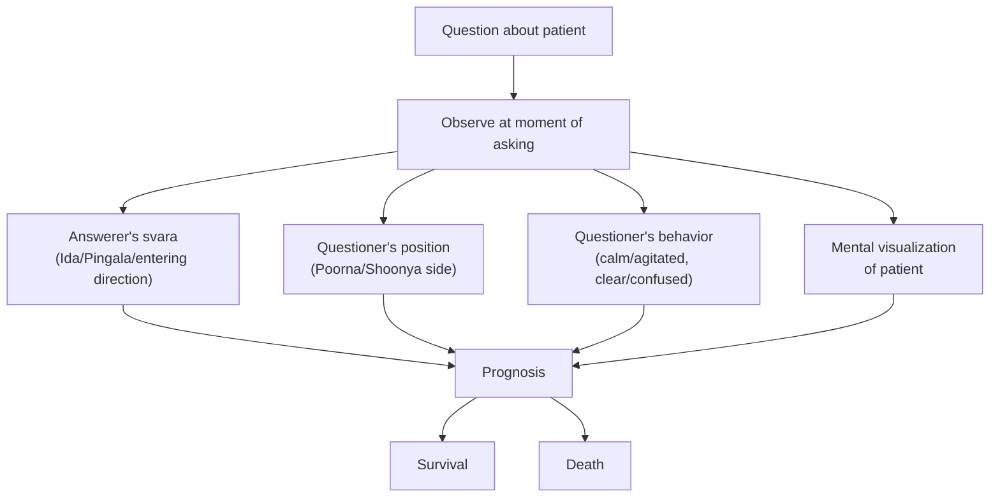

# Disease Prognosis

[↩ Back to overview](00-overview.md)

> 📖 Verses 316–326

The disease domain `§316-326` addresses two questions: **what caused the illness?** and **will the patient survive?** The text treats disease prognosis as a **relational reading**, not an isolated bodily assessment. The outcome depends on the svara of the questioner (the person asking about the patient), the svara of the answerer (the person giving the prognosis), and the position, behavior, and appearance of the questioner — not just the patient's condition.

This relational structure makes the system fundamentally different from a medical diagnosis. The reading includes the whole situation — the questioner's position, the answerer's breath-state, the timing, and the mental visualization of the patient. The patient need not be physically present.

## Cause attributed by tattva

When someone asks about a disease, observe **which tattva is active at the moment the question is asked** `§316`. The active element indicates the attributed cause `[claim]`:

| Tattva at time of question | Attributed cause |
|---|---|
| **Earth** | Previous-birth karma (karmic causation) |
| **Water** | Kapha dosha (phlegm imbalance in humoral system) |
| **Fire** | Shakini (local goddess/spirit), unhappy deceased ancestors, or environmental-spiritual disturbance |

Air and Ether are not explicitly assigned disease causes in this section, though they appear in prognosis and irregular-flow rules. The text gives three causal frameworks: **karmic** (Earth), **humoral** (Water), and **spiritual-environmental** (Fire). These are traditional attributions from the text's worldview, not empirical medical categories.

## Prognosis rules — the relational reading

The prognosis for survival depends on **the relationship between questioner, answerer, and their breath-states** at the moment the question is asked `§317-325`. All of these factors must be observed simultaneously `[claim]`:

### Favorable signs (patient survives)

**Questioner position:**
- Questioner sits on **Shoonya** (closed) side, then **shifts to Poorna** (active) side → patient survives even from deep coma `§317`
- Questioner sits on **Poorna** (active) side throughout → patient survives despite many diseases `§318`

**Questioner speech:**
- Questioner speaks "terrible things" (dire predictions) during **solar svara** flow → patient survives `§319`

**Mental visualization:**
- Answerer accurately visualizes the patient's image (based on questioner's description) and **stabilizes it in mind** → patient survives `§320`

**Svara timing:**
- Question asked while answerer's svara (solar or lunar) is **just entering the body** + questioner facing the people present → patient recovers `§321`

**Relative position:**
- Questioner's standing level is **below the Jivanga** (life-point/navel level) of the answerer → patient survives `§322`

### Unfavorable signs (patient will die)

**Combined negative factors:**
- Questioner sits on **Shoonya** (closed) side + speaks confusing words + appears confused + svara flows erratically → adverse outcome `§323`

**Svara mismatch:**
- Answerer's **lunar svara** flows + questioner sits toward **solar side** → patient dies despite hundreds of doctors `§324`
- Answerer's **solar svara** flows + questioner sits toward **left side** → patient dies even if Lord Shiva intervenes `§325`

The text uses absolute language ("even if Lord Shiva himself comes") to describe these death prognoses.

### How the reading works

The answerer observes:
1. **Their own svara** at the exact moment the question is asked (which nadi flows, which direction it enters)
2. **Questioner's position** relative to their Poorna/Shoonya sides
3. **Questioner's behavior** (calm or agitated, clear speech or confused)
4. **Questioner's relative height** (above or below navel level)
5. **Mental visualization** of the patient (can they clearly picture the patient based on description?)

The combination of these factors produces the prognosis. The patient's actual physical condition is not directly observed — the reading operates through the **questioner-answerer interaction** as a proxy.

## Irregular svara flow as disease indicator

Beyond the relational prognosis, the text describes **irregular svara patterns** as direct indicators of disease and death `§326` `[claim]`:

| Pattern | Outcome |
|---|---|
| **One element** flows erratically | Disease occurs |
| **Two elements** flow erratically | Separation from kin/relatives |
| **Irregular flow for ~1 month** | Death |

This suggests two parallel diagnostic modes:
- **Prashna mode:** Someone asks about a patient → observe questioner-answerer dynamics
- **Self-observation mode:** You observe your own svara patterns over time → irregular flow indicates your own health decline (expanded extensively in [Death](09-bhukti-lifespan-prognosis.md))

The irregular-flow rules apply to the person whose svara is irregular, not to a third-party patient. If your own breath-pattern remains erratic for a month, the text considers this a sign of impending death.

## Why disease matters

This domain shows the svara system applied to **prognosis through relational observation**. Unlike [War](06-bhukti-combat.md) (one person's svara determines their action timing) or [Conception](07-bhukti-conception.md) (two partners' svaras interact to create outcome), disease prognosis operates through a **three-party system**: patient (visualized), questioner (physically present), answerer (observing their own svara).

The key insight is **proxy observation** — you don't examine the patient directly; you examine the breath-state configuration of the question-asking moment. This makes it a divinatory system, not a diagnostic one. The text assumes that the questioner-answerer breath-state interaction at the moment of asking reveals something about the patient's fate, even if the patient is miles away.

The irregular-flow rules provide a complementary framework: your own sustained breath irregularity indicates your own health trajectory. This is self-observation, not relational divination.

This domain also demonstrates the text's **layered causation model**: karmic (Earth), humoral (Water), and spiritual-environmental (Fire). The text doesn't choose between these frameworks — it presents all three as valid depending on which tattva is active when the question arises. Causation itself is determined by the moment of inquiry, not by the disease's physical etiology.

This is a divinatory domain — prognosis through relational observation rather than direct examination or intervention.

---

⏮ [Prev: Conception](07-bhukti-conception.md)  ·  ↩ [Overview](00-overview.md)  ·  📖 [Glossary](glossary.md)  ·  [Next: Lifespan Prognosis](09-bhukti-lifespan-prognosis.md) ⏭
