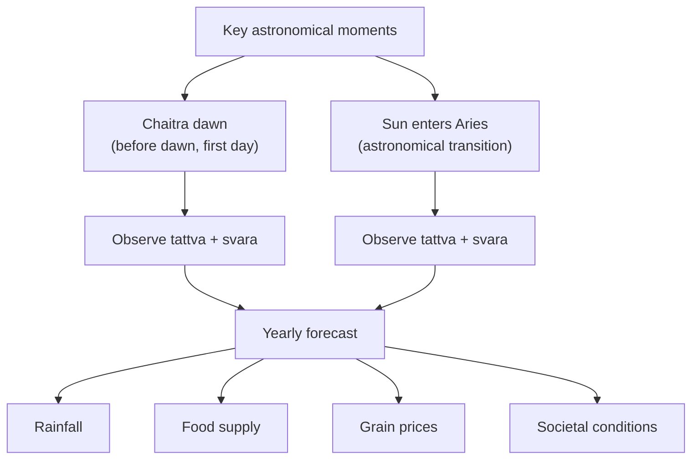

# Weather & Agriculture

[↩ Back to overview](00-overview.md)

> 📖 Verses 302–315

The cosmic forecast domain `§302-315` scales the svara system from **individual** to **collective** — predicting weather, harvest, food supply, and societal conditions based on the tattva and svara observed at specific astronomical moments. The practitioner reads their own breath at these key times and uses that reading to forecast the year ahead for the entire community `[claim]`.

The text specifies **two observation moments** for yearly forecasts:
1. **Chaitra dawn** (first day of Chaitra month, before dawn, sun moving north) `§302-304`
2. **Sun enters Aries** (astronomical transition) `§306-315`

Both readings operate on the same principle: the tattva and svara flowing in the practitioner's body at a specific cosmic moment reflects the conditions that will manifest in the external world during the coming year `[claim]`.

## Observation 1 — Chaitra dawn

The text instructs the practitioner to observe their tattva and svara on the **first day of Chaitra month** (traditionally March-April), in the morning **before dawn**, when the sun is moving north `§302-304` `[claim]`:

**Favorable combinations:**
- **Earth, Water, or Air** + **Lunar svara** flowing → abundance of wheat and good grains during the year `§303`

**Unfavorable combinations:**
- **Fire or Ether** active → famine and food shortage `§304`

The text states: "Thus, one must calculate the results of the forthcoming days, months and years in advance through the tattvas" `§304`.

## Observation 2 — Sun enters Aries

The text instructs "knowers of tattva" to examine svaras during the sun's transition into Aries and predict the year's events accordingly `§306-307`. This observation gives **more detailed forecasts** by element `§308-312` `[claim]`:

| Tattva at Aries entry | Yearly forecast |
|---|---|
| **Earth** `§308` | Abundance of food · superior farming · greater yield · prosperity · overall development of the country |
| **Water** `§309` | Excellent rains · abundant food · freedom from disease · happiness · prosperity · abundance of food grains |
| **Fire** `§310` | Famine · destruction of nation · destruction of food-grains · scanty rainfall |
| **Air** `§311` | Trouble · calamity · destruction by natural and man-made disasters · fear · scanty rainfall |
| **Ether** `§312` | Want of happiness · scarcity of food-grains |

**General principle:** Earth and Water indicate auspicious results; Fire, Air, and Ether indicate inauspicious results `§307`.

### Svara at Aries entry

Beyond tattva, the **svara flowing at this moment** also matters `§313-315` `[claim]`:

**Poorna svara (active nostril):** Inhaling the Poorna svara at this time → production of food-grains `§313`

**Irregular flow:** If solar or lunar svara is flowing erratically or irregularly → storing food-grains is beneficial because there will be acute shortage `§313`

**Specific warning combination:** Fire element + solar svara + ether element activating during Aries entry → start storing food-grains immediately because steep price inflation within two months `§314`

**Catastrophic combination:** Solar svara flows at night + lunar svara flows in morning + Air/Fire/Ether dominant → "hell like conditions prevail on earth itself" `§315`

The last combination describes **complete svara inversion** (solar at night instead of lunar, lunar in morning instead of solar) combined with unfavorable tattvas. The text uses absolute language to describe the severity.

## Sushumna's adverse nature for worldly activities

The text embeds a warning about **Sushumna** within the cosmic forecast section `§305` `[claim]`:

**"The Sushumna nadi is cruel and adverse for all activities. If one performs any kind of activity during its flow (except yoga Sadhna), he inevitably suffers afflictions like destruction of country, epidemics, sorrows, sufferings, etc."**

This statement connects individual Sushumna flow to collective disasters. The text states that performing activities during Sushumna flow causes inevitable afflictions. Sushumna is favorable only for yoga practice, unfavorable for all worldly activities.

>Note: In the yoga path (see [Yoga path](11-mukti-yoga.md)), Sushumna serves as the central channel for spiritual ascent.

## Practical grain storage rules

The text gives **actionable agricultural advice** based on the readings `§313-314`:

**When to store grain:**
1. When solar/lunar svara flows **irregularly** at Aries entry `§313`
2. When **Fire + solar svara + ether activating** at Aries entry (act immediately, inflation within 2 months) `§314`
3. When reading indicates famine/shortage conditions

The text gives these forecasts as bases for storage and purchasing decisions.

## Why cosmic forecast matters

This domain applies the svara system to **collective forecasting** — weather, agriculture, food supply, economic conditions, and societal well-being. The practitioner observes their own breath at two specific astronomical moments (Chaitra dawn and Sun entering Aries) and uses that observation to predict conditions for the entire community over the coming year.

The text presents breath-state at cosmic transition points as reflecting and predicting collective conditions. The forecasts include specific storage recommendations, timing warnings, and grain price predictions.

The Sushumna warning `§305` states that performing worldly activities during Sushumna flow causes collective afflictions (destruction of country, epidemics, sorrows). This connects individual breath-state during activities to communal consequences.

This is the collective forecasting layer — individual breath at cosmic moments as predictor of communal conditions.

---

⏮ [Prev: Lifespan Prognosis](09-bhukti-lifespan-prognosis.md)  ·  ↩ [Overview](00-overview.md)  ·  📖 [Glossary](glossary.md)  ·  [Next: Yoga Path](11-mukti-yoga.md) ⏭
