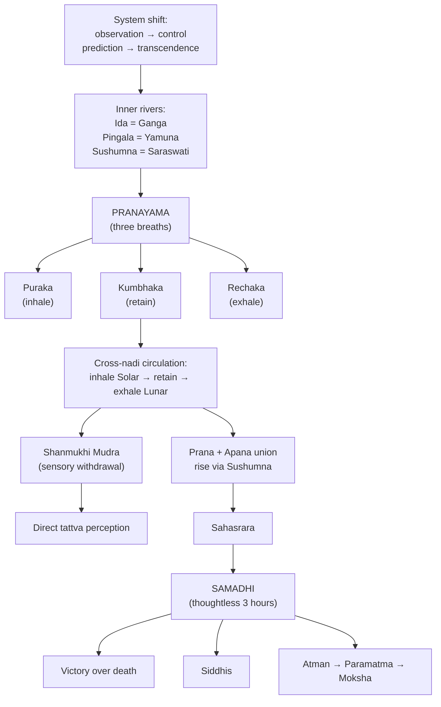

# The Yoga Path (Mukti)

[↩ Back to overview](00-overview.md)

> 📖 Verses 375–396

The yoga domain `§375-396` shifts the system from **prediction to transformation**. The preceding domains (tattvas through cosmic forecast) used svara knowledge to predict and navigate worldly outcomes — war, health, conception, weather. This section uses the same knowledge to transcend those outcomes entirely. "Initially, the means of instant result achievement was described. Now the yogi must sit in Padmasana (lotus posture) and practice..." `§376`.

The section heading changes from general topics to **"Section on Samadhi"** `§375`, signaling the shift from bhukti (worldly engagement) to mukti (liberation).

## The inner rivers — sacred geography internalized

A correspondence between **external pilgrimage geography** and **internal nadi structure** `§375` `[claim]`:

| External (sacred river) | Internal (nadi) |
|---|---|
| **Ganga** (Ganges) | Ida (lunar nadi) |
| **Yamuna** | Pingala (solar nadi) |
| **Saraswati** (hidden river) | Sushumna (central nadi) |

**Prayaga** (Allahabad), the famous confluence point where the three rivers meet externally, is stated to occur **internally** at the meeting point of the three nadis — "the knowledge of merging these three nadis" `§375`.

Pilgrimage, bathing in sacred waters, and ritual purification — all external practices — have internal equivalents in pranayama `[claim]`.

## The three breaths of pranayama

**Three phases of breath control**, each with specific functions `§377-379` `[claim]`:

| Breath phase | Sanskrit | Function |
|---|---|---|
| **Inhalation** | Puraka | Maintains equilibrium of body's essential minerals/ingredients · bestows "life-nectar" through specific practices · nourishes the body |
| **Retention** | Kumbhaka | Maintains the body in its present condition · safeguards the body · key to Sushumna practice |
| **Exhalation** | Rechaka | Destroys all evil karmas · purification function |

"Thus, by doing all these three pranayams one becomes a yogi. After these three pranayams the mind gets steady therefore one must start practicing Sadhana to conquer death methodically" `§379`.

### Cross-nadi circulation

**Cross-nadi breathing pattern** `§380-381` `[claim]`:

**Standard practice:**
- **Inhale** through Solar (Pingala) nadi
- **Retain** (Kumbhaka)
- **Exhale** through Lunar (Ida) nadi

**Advanced practice:**
"One who incessantly drinks his lunar svara with his solar svara and his solar svara with his lunar svara, without the consideration of time of their flow, lives till the life of moon and stars" `§381`.

Continuous alternation: inhaling one nadi with the other, regardless of which is naturally active at that moment. This is presented as a practice for extreme life extension.

### Restraining both breath and mouth

"One who restrains the active nadi as well as his mouth from breathing, simultaneously, achieves youthfulness even if he is quite old" `§382` `[claim]`.

Dual restraint — stopping breath through the nose (restraining the active nadi) while also keeping the mouth closed. Rejuvenation and reversal of aging are attributed to this practice.

## Shanmukhi Mudra — closing the six gates

**Shanmukhi Mudra:** "the process of closing the mouth, nostrils, ears and eyes" `§383`. Sensory withdrawal — blocking all six external gates (two nostrils, two ears, two eyes, plus mouth) `[claim]`.

**Result:** "This bestows knowledge of tattvas" `§383`. Specifically, "the form, colour, motion, taste, region and other attributes of five elements can be known by the practice of Shanmukhi Mudra and the Swara science" `§384` `[claim]`.

This is the method referenced in [Tattvas](01-tattvas.md) for directly perceiving the elemental forms (circle, crescent, triangle, dot) and qualities.

## Victory over death

Yogic practice as **conquest of Yama** (lord of death): "A yogi who is free from desires, sins, and expectation who does not think about the objects of senses, obtains victory over death like a child's play" `§385` `[claim]`.

The path:
1. **Withdrawal:** Free from desires, sins, expectations, not thinking about sense objects `§385`
2. **Steadiness:** Mind becomes thoughtless (expanded in samadhi section below)
3. **Pranayama:** Three-breath control with cross-nadi circulation
4. **Result:** Victory over death

This is the yogic resolution to the death prognosis given in [Death](09-bhukti-lifespan-prognosis.md). Instead of predicting death through diagnostic signs, the practitioner transcends death through pranayama and mental steadiness.

## The breath as mantra — So-Ham / Ham-sa

The **natural sound of breath** as mantra of Self `§10, §51` `[claim]`:

- **Inhale sound:** SA (or SAH)
- **Exhale sound:** HA (or AH)
- **Combined:** So-Ham (or Ham-sa, depending on which sound is emphasized first)

**Meaning:** "So-Ham" = "That I am" (Tat = That, Aham = I). The breath itself continuously recites the identity of the individual self (Atman) with the cosmic Self (Paramatma).

"By meditating on the 'Sah' sound while inhalation and on 'aham' sound while exhalation (thereby forming the mantra 'so-ham') one becomes omniscient and acquires the knowledge of the past, present and the future" `§10` `[claim]`.

**Involuntary mantra** — the breath is already reciting it continuously. The practice is to become conscious of it, to listen to what is already occurring.

"Lord Shiva himself resides in the So-ham / Sushumna nadi in the form of Ham-Sa... therefore the Sushumna is verily known as the form of Lord Shiva himself" `§51`.

## Samadhi — sustained thoughtlessness

**Samadhi:** the state where "the mind gets steady and thoughtless even for one Yama (three hours)" `§386` `[claim]`.

**Results:**
- "Acquires the power of seeing, knowing, and experiencing the entire universe through his eyes" `§386`
- "The age of such a person increases at the rate of three ghatikas per day" `§387`
  - *(Note: 1 ghatika = 24 minutes, so 3 ghatikas = 72 minutes. This states that the practitioner's lifespan increases by 72 minutes for each day of practice.)*
- Knowledge of past, present, and future (from So-Ham meditation `§10`)
- Siddhis (perfections/powers)

"Lord Shiva has himself mentioned this in a tantra describing the qualities of Siddhas" `§387`.

## Prana-Apana union and the rise to Sahasrara

**Core technique** for Sushumna activation `§376, §388` `[claim]`:

**The practice `§376, §388`:**

1. **Sit in Padmasana** (lotus posture) — establish stable seated position
2. **Apply Uddiyana Bandha** — abdominal lock that prevents apana (downward-moving vital air) from descending; holds it at the navel
3. **Reverse apana's direction** — what normally moves downward is now directed upward
4. **Unite prana and apana** — the upward-moving vital air (prana, from below heart) meets the reversed apana; they merge into single energetic current
5. **Direct united current into Sushumna** — the combined prana-apana enters the central channel (Sushumna nadi) through the Sushumna Randhra (opening at base of spine or navel region)
6. **Ascend to Sahasrara** — the united current rises through Sushumna to the crown chakra (Sahasrara)
7. **Release into space** — at the crown, the combined prana is released upward "into the sky"

"They are blessed, who sitting in Padmasana... [perform this practice]" `§388`. "Such devotees of Lord Shiva go to the abode of Lord Shiva via sky after their death" `§389` `[claim]`.

**Central channel ascent** — the core technique of kundalini yoga. Apana (normally descending) is reversed upward, united with prana (normally ascending from below), and the combined energy rises through Sushumna to the crown.

## Contemplation on Jiva and the play of creation

**Contemplative practice** `§270` `[claim]`:

**"One must meditate upon the Jiva (his own self or Atman). Upon its creation right from the beginning, to its establishment in the human body via the support and movement of Vayu — the air element. One must be immersed in this play thoroughly and forever. By doing this, one is victorious in game of life (i.e. attains liberation). This game is as dicey as gambling."**

The sequence: **creation → embodiment via Vayu → the play of life**. The practitioner contemplates:
- How the Jiva (individual soul) came into being
- How it entered and established in the body through Vayu (breath/prana)
- The entire play/game of embodied existence

Life as **game** ("as dicey as gambling") that can be mastered through understanding its mechanism — prana, tattvas, nadis, svaras. The svara system as rulebook for the game. Victory means liberation, not just success in worldly affairs.

## The supreme value of this knowledge

The closing verses `§390-396` emphasize the **supreme value** of svara knowledge `[claim]`:

**Superiority claims:**
- "Even the trillion-fold knowledge and possession of material wealth, herbs and other chemicals is nothing as compared to the knowledge of the three nadis and tattvas" `§393`
- Just as Omkara is eulogized by Vedas and Sun by Brahmanas, "the master practitioner of Swara Science is the best and worshipped in this ephemeral world" `§392`
- "There is nothing on earth to repay the debt of that Guru who has imparted the knowledge of even a single syllable of the Swara Science" `§394`

**Practical benefits:**
- "The master practitioner of swara science has Lakshmi (prosperity, fortune) as her slave. He always enjoys physical pleasures" `§391`
- "The Sadhaka (practitioner) who reads and practices this text daily gets perfected in this science" `§390`

**Recommended practice:**
- "As per the yogis and siddhas the recitation of this text during the solar and lunar eclipses bestows siddhi (perfection)" `§396`
- "The yogi must practice moderation in food and sleep, and concentrate on Paramatma (the supreme soul) steadily and realize him" `§396`

## The text's statement on incompleteness

`§395` `[claim]`:

**"In this Swara Shastra the details regarding the flow of Swaras along with their results, the knowledge of tattvas (and how to employ them for one's well being), war (method of winning), the captivation and enchantment of women, details regarding child-conception, and disease, etc. have been described in half-a-measure only."**

This states that **everything in the 396 verses is incomplete** — only "half-a-measure" of the full knowledge. Written texts in tantric tradition often serve as memory aids for initiates who receive complete teaching orally from a qualified guru.

## Why the yoga path matters

This domain applies svara knowledge to **internal transformation** rather than external prediction. The bhukti domains (tattvas through cosmic forecast) used svara for navigating worldly outcomes. This domain uses the same elements (prana, tattvas, nadis, svaras) redirected through pranayama, mudra, and samadhi.

Key elements:
- **Inner rivers** `§375`: External pilgrimage geography (Ganga, Yamuna, Saraswati) mapped to internal nadis (Ida, Pingala, Sushumna)
- **So-Ham mantra** `§10, §51`: Breath continuously recites "That I am" involuntarily
- **Shanmukhi Mudra** `§383-384`: Sensory withdrawal enables direct tattva perception
- **Prana-Apana union** `§376, §388`: Seven-step technique for central channel ascent to Sahasrara
- **Samadhi** `§386-387`: Sustained thoughtlessness (3 hours) produces siddhis and lifespan increase
- **Victory over death** `§385`: Withdrawal from sense objects, mental steadiness, pranayama

The incomplete-text statement `§395` indicates the 396 verses contain only "half-a-measure" of the full knowledge.

This is the transformation layer — same breath-science elements redirected from prediction to transcendence.

---

⏮ [Prev: Weather & Agriculture](10-bhukti-weather-agriculture.md)  ·  ↩ [Overview](00-overview.md)  ·  📖 [Glossary](glossary.md)  ·  [Next: Unifying View](12-unifying-view.md) ⏭
