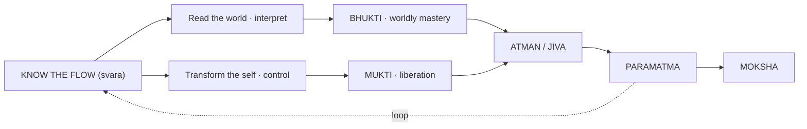

# Unifying View

[↩ Back to overview](00-overview.md)

> 📖 Verses 13–31, 371–396

When you strip away the specific applications — war, disease, conception, weather — **one architecture remains**: the knowledge of svara (breath-flow) used in two directions. The system can be turned either outward (to read and navigate the world) or inward (to transform and transcend the self).

This page synthesizes the system's unifying structure and identifies **eight notable characteristics** — places where the text presents apparently contradictory claims or unexplained mechanisms.

## Three uses of svara

The system operates svara knowledge in **three ways**:

| Use | Leads to |
|---|---|
| **Observe** | Know the present state → awareness of current svara/tattva flow |
| **Interpret** | Predict outcomes → **Bhukti** (worldly mastery through timing and position) |
| **Control** | Pranayama / Sushumna activation / samadhi → **Mukti** (liberation through transformation) |

Observation identifies which nadi flows, which tattva is active, which direction the breath moves. Interpretation applies observation to predict outcomes in specific domains (war, conception, weather, death). Control redirects breath through pranayama to alter the system itself.

## Three interacting levels

The system operates across **three levels** treated as causally linked:

- **Cosmic** — tattvas emanate from Paramatma `§4-8`, planetary movements `§183-185`, sun's entry into Aries determines yearly conditions `§306-315`, weather and food supply `§302-315`
- **Human** — prana animates the body `§43-48`, nadis carry flow `§32-71`, svara is observable interface `§49-71`, health and lifespan determined by breath patterns `§316-374`
- **Yogic** — pranayama controls breath `§377-380`, kumbhaka activates Sushumna `§376-388`, samadhi produces transcendence `§386-389`, moksha as reabsorption into Paramatma `§396`

Cosmic events shape human breath-states; human breath is the observable layer; yogic practice redirects breath for transformation.

## The body as one instrument, four ways

**The body functions in four simultaneous modes:**

1. **Living organism** — subject to birth `§9`, health, disease `§316-326`, death `§327-374`
2. **Pranic system** — animated by tattvas `§1-9`, prana and five vayus `§43-48`, 72,000 nadis `§32-33`
3. **Divinatory instrument** — body regions predict war outcomes `§231-245`, symptoms indicate death proximity `§339-370`, svara combinations predict patient survival `§317-325`
4. **Yogic instrument** — vehicle for pranayama `§377-380`, Sushumna activation `§376-388`, samadhi `§386-387`

The body serves as diagnostic surface (disease), predictive interface (bhukti domains), and transformative medium (mukti practice) simultaneously.

## Value, transmission, and ethics

**Traditional value system** `§11-31, §390-396` `[claim]`:

**Supreme value claims:**
- "This science is most secretive of all secret knowledges. It is the best as it reveals the most essential and beneficial knowledge" `§11`
- "Nothing in the universe seen, heard, or otherwise experienced is better, more confidential, or subtle than the knowledge of svaras" `§21`
- "Even the trillion-fold knowledge and possession of material wealth, herbs and other chemicals is nothing as compared to the knowledge of the three nadis and tattvas" `§393`
- Svara practitioner compared to Omkara (eulogized by Vedas) and Sun (worshipped by Brahmanas) `§392`

**Guru transmission:**
- "There is nothing on earth to repay the debt of that Guru who has imparted the knowledge of even a single syllable of the Swara Science" `§394`
- Knowledge must not be given simply to answer queries but "kept safe in one's mind/psyche, voice and intellect to use it for the evolution of the atman" `§28`

**Eligibility criteria** `§13-14`:

**To be taught only to those who are:**
- Peaceful disposition
- Pure of thoughts and conduct
- Disciplined
- Boundless devotion to guru
- Firm determination
- Grateful toward benefactors

**To be denied to those who are:**
- Wicked
- Lacking virility
- Short tempered
- Vicious/atheist
- Lacking character
- Commit adultery with guru's wife

**Body preservation:**
- "Since this body is a means of dharma (righteous conduct), artha (accumulation of wealth), kama (enjoyment of pleasures), and moksha (liberation)... therefore it must be preserved" `§373`
- "Bad and immoral conduct, fault in bowel movements and sperm's non-preservation destroy the body. Balanced prana increases strength, vitality and vigour" `§372`

These represent the text's own value framework from its traditional context.

## The liberation sequence

**Creation to liberation path** `§4-9, §375-396`:

> Paramatma (formless supreme self) `§6` → Five tattvas emanate `§6-8` → Body created from tattvas `§9` → Prana animates body via nadis `§32-51` → Svara as observable interface `§49-71` → Practitioner observes svara → Applies pranayama `§377-380` → Activates Sushumna `§376-388` → Achieves samadhi `§386-387` → Realizes Atman = Paramatma → Moksha (liberation/reabsorption)

Liberation returns to the source: "Such devotees of Lord Shiva go to the abode of Lord Shiva via sky after their death" `§389`. Moksha is reabsorption into the same Paramatma from which the tattvas originally emanated.

---

## Eight notable characteristics

The text contains **eight notable characteristics** — places where rules conflict, mechanisms are unexplained, or contradictory claims coexist.

### Characteristic 1 — Sushumna's dual role

**Worldly-adverse:**
- "The Sushumna nadi is cruel and adverse for all activities. If one performs any kind of activity during its flow (except yoga Sadhna), he inevitably suffers afflictions like destruction of country, epidemics, sorrows, sufferings" `§305`

**Spiritually-essential:**
- Prana-apana union rises through Sushumna to Sahasrara for liberation `§376, §388`
- "Lord Shiva himself resides in the So-ham / Sushumna nadi in the form of Ham-Sa" `§51`

The text describes Sushumna as both catastrophic for worldly action and necessary for spiritual ascent.

### Characteristic 2 — Tattva outcomes depend on context

The same element produces different outcomes in different domains:

**Fire tattva:**
- **War** `§244-245`: Injury to thighs/hips
- **Conception cause** `§316`: Shakini (spirit), ancestors, environmental-spiritual disturbance
- **Conception sex** `§295`: Abortion or miscarriage
- **Conception character** `§298`: Short-lived child
- **Cosmic forecast** `§310`: Famine, destruction, scanty rainfall
- **Disease** `§326`: (Not explicitly assigned in disease causation)

### Characteristic 3 — Ida and Pingala outcomes vary by context

**Ida (lunar) can be:**
- **Favorable**: For receptive activities, inward actions, defensive war stance (holder/invaded wins) `§246-251`
- **Unfavorable**: If patient questioner sits on Ida side during disease prognosis → death `§323-325`

**Pingala (solar) can be:**
- **Favorable**: For active/projecting actions, offensive war stance (challenger wins) `§246-251`, grain production if Poorna flows at Aries entry `§313`
- **Unfavorable**: If flows continuously for 2 days → death in 2 years `§333`, if flows at night + lunar in morning → catastrophic conditions `§315, §335`

### Characteristic 4 — Conception sex-determination conflicts

**Prashna context** (divination when someone asks) `§296`:
- Lunar svara flows → girl
- Solar svara flows → son
- Sushumna flows → eunuch
- Questioner on Poorna side → son

**Conception context** (at moment of intercourse) `§295, §298-300`:
- Water tattva dominant → son (§295) OR girl (§300)
- Earth tattva dominant → daughter (§295) OR virtuous child (§300)
- Fire tattva → abortion/miscarriage (§295) OR short-lived (§298)

The text acknowledges this: "If, suddenly, the lunar svara flows during the flow of solar svara or vice-versa then one must ask about the consequence from the Guru only. The Vedas and crores of other Shastra are of no avail in this regard" `§301`. See [Conception](07-bhukti-conception.md) for full analysis.

### Characteristic 5 — Death prediction systems operate independently

Five diagnostic systems for death proximity `§327-374`:
1. **Sustained svara patterns** (same svara continuous → 3 years to 1 month remaining)
2. **Sun reflection in water** (distortions by direction → 6 months to same day)
3. **Messenger appearance** (characteristics of person asking about patient)
4. **Bodily/sensory signs** (descending ladder from 11 months to 1 day)
5. **Shadow observation** (missing body parts in shadow → weeks to seconds)

The text provides no rules for reconciling contradictory predictions or hierarchy stating which system takes precedence.

### Characteristic 6 — Cosmic-bodily correspondence without mechanism

**The correspondence:**
Your breath-state (which tattva/svara flows in your nostrils) at specific cosmic moments (Chaitra dawn `§302-304`, Sun entering Aries `§306-315`) predicts the coming year's collective conditions (rainfall, food supply, societal well-being).

**No mechanism explained:**
- Why individual breath reflects collective conditions
- How nostril flow at one moment determines weather patterns for a year
- What connects the microcosm (human body) to macrocosm (cosmic events)

The text states "The wise yogi must reflect about the elements during the first day of Chaitra... then there will be an abundance of wheat" `§302-303` without explaining the causal mechanism.

### Characteristic 7 — Enchantment techniques without mechanism

**Techniques presented** `§276-286`:
- Inhaling partner's lunar breath with your solar breath
- Retaining breath in heart region
- Drinking Sushumna svara during sleep
- Matching or opposing polarity states
- Svara manipulation during specific timing windows

The text describes these as methods for influencing attraction and conception but does not explain the mechanism.

### Characteristic 8 — Tattvas as breath-qualities, not substances

**Tattvas are not physical substances:**
- Earth = stable, heavy, solid **quality** perceived through breath-character
- Water = flowing, adhesive **quality** 
- Fire = rising, transforming **quality**
- Air = moving, dispersing **quality**
- Ether = subtle, spacious **quality**

These are phenomenological categories known through **felt character of breath**, not chemical elements (oxygen, hydrogen, carbon). "The form, colour, motion, taste, region and other attributes of five elements can be known by the practice of Shanmukhi Mudra" `§384` — through internal observation, not external measurement.

---

## Why this synthesis matters

**This perspective provides:**

- **Single system visibility** — across 396 verses: all applications derive from one architecture (observe-interpret-control flowing through cosmic-human-yogic levels)
- **Structural clarity** — understanding the bhukti/mukti division shows why war tactics and samadhi instructions coexist in one text
- **Contextual reading** — recognizing that tattva meaning depends on domain (war vs. disease vs. conception)
- **Characteristic awareness** — identifying where rules conflict (conception sex-determination, death systems, Sushumna dual role)
- **Traditional frame recognition** — eligibility criteria and value claims belong to the text's own context
- **Category clarity** — distinguishing tattvas as breath-qualities from modern chemical elements

Understanding the architecture shows how the system's parts connect; understanding the notable characteristics shows what the text explains and what it leaves unexplained.
