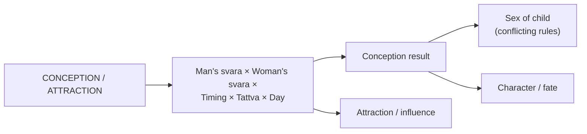

# Conception & Enchantment

[↩ Back to overview](overview.md)

> 📖 Verses 276–301

The conception domain `§276-301` applies the svara system to fertility and interpersonal attraction, treating the interaction of male and female svaras as a **polarity model** that determines conception outcomes, the sex and character of the child, and the success of enchantment practices.

All outcomes described here are **traditional textual claims** `[claim]`, and the text itself contains **internal conflicts** — different verses give incompatible rules for the same outcomes. The system does not reduce to a single formula.

## The polarity model

The text treats male-female interaction as a **svara polarity system** `§277-283, 287-293`. At any given moment, each partner has:
- An active nadi (Ida/lunar or Pingala/solar or Sushumna)
- A Poorna (active) or Shoonya (closed) side
- A flowing tattva
- A breath-state that can be consciously controlled

The **combination** of these states between partners is said to determine outcomes. Key variables include:
- **Matching** (both lunar, both solar) vs **opposing** (one lunar, one solar) svaras
- **Timing** (which day after menstruation, odd vs even day)
- **Transitions** (svara changing during the act)
- **Intentional breath control** (deliberately holding or exchanging svaras)

The text describes both **passive observation** (what naturally occurs predicts outcomes) and **active manipulation** (controlling your svara to influence outcomes).

## Enchantment and attraction techniques

The enchantment section `§276-286` describes specific techniques for creating interpersonal attraction or influence through **deliberate svara manipulation** `[claim]`:

**Core technique:** The man **inhales the woman's lunar svara using his solar svara** and **retains it in his heart chakra (anahata)** `§277-278`. This is said to create lasting influence or attraction.

**Svara matching methods:**
- **Active-to-active:** Match your active svara to her active svara, then inhale her breath and retain it in the heart `§278`
- **Opposite polarity:** Unite solar (man) with lunar (woman) or lunar (man) with solar (woman) `§282`
- **Sushumna drinking:** If the woman is asleep during the last three hours of night, inhale her Sushumna svara (the breath when both nadis flow or transition) `§279`
- **Post-Sushumna timing:** After her Sushumna flow ends, consciously direct your lunar svara toward her while chanting an eight-syllable mantra (Om Namo Narayana) `§280`

**Repetition rules** `§283`:
- **Odd numbers (3, 7, 9 repetitions):** When woman's lunar + man's solar are united
- **Even numbers (2, 4, 6 repetitions):** When woman's solar + man's lunar are united

**Warning from the text:** Verse 286 ends with "This method must not be disclosed to anyone. This is my command" `[claim]`.

## Conception timing and svara combinations

For conception, the text gives specific timing rules based on **days after menstruation** and **svara combinations** `§287-293` `[claim]`:

**Favorable combinations for conceiving a son:**
- **Fifth day after menstruation:** Woman's lunar svara + man's solar svara `§287`
- **Odd-numbered days (1, 3, 5, 7):** Male solar + female lunar + fire element active `§291`
- **Beginning of fertile period:** Husband's solar + wife's lunar flowing `§292`
- **Svara transition:** Husband's solar at beginning, transitions to lunar by end `§293`

**Additional practices:** After the menstrual cycle, during water or earth element flow, the woman takes the herb **Shankhballi** mixed in cow's milk, then requests pregnancy from her husband three times `§288-289`. This is said to produce a handsome, brave son.

**Unfavorable timing:**
- Solar svara flowing **after Sushumna** = crippled or ugly child `§290`
- Sushumna flowing during intercourse = miscarriage or eunuch `§294, 296`

The text emphasizes that **timing the moment** — both the day within the fertile window and the exact breath-state at the moment of intercourse — determines the outcome.

## Sex determination — prashna versus conception

The text gives rules for predicting the sex of a child in **two different contexts**: (1) **prashna** (answering questions about an existing or future pregnancy) and (2) **conception** (predicting outcomes based on the exact moment of conception). These two contexts use overlapping variables but produce conflicting answers `[claim]`.

### Prashna rules (when someone asks about pregnancy)

When someone asks a question about childbirth, observe your own svara and tattva at the **moment the question is asked** `§294-297`:

**By svara** `§294, 296`:
- Question during **Ida (lunar)** flow → daughter
- Question during **Pingala (solar)** flow → son
- Question during **Sushumna** flow → miscarriage or eunuch

**By tattva** `§295`:
- **Earth** active → daughter
- **Water** active → son
- **Air** active → girl-child
- **Fire** active → abortion/miscarriage
- **Ether** active → impotent child or eunuch

**By position** `§296-297`:
- Questioner on **Poorna** (active) side → son
- Questioner on **Shoonya** (closed) side → no child
- **Both svaras** flowing → twins
- **Mixed/alternating** svaras → miscarriage

These prashna rules apply to divination — someone arrives asking "Will the child be a boy or girl?" and you observe your own breath-state at that moment to give the answer. The prediction is based on the **answerer's svara**, not the pregnant person's state.

### Conception rules (at the moment of intercourse)

Verses §298-300 describe what happens based on the tattva active **at the moment of conception itself**. These verses focus on **character and outcome** more than sex:

| Tattva at conception | Outcome |
|---|---|
| **Water** | Wealthy · famous · prosperous · fortunate (§298-299) **Also:** girl child (§300) |
| **Earth** | Prosperous · brave · virtuous · hedonistic (§298, 300) Sex not specified |
| **Air** | Melancholy disposition (§298) Sex not specified |
| **Fire** | Abortion or short-lived child (§298) |
| **Ether** | Miscarriage (§299) |

### The conflict

The **direct contradiction** is in tattva interpretations:

- **Water:** Prashna says **son** `§295`, but conception says **girl** `§300`
- **Earth:** Prashna says **daughter** `§295`, but conception says **good child** with no sex specified `§298, 300`

The text does not resolve this. The rules may apply to genuinely different scenarios (prashna = divination magic, conception = physical causation), or they may represent **variant traditions compiled into one text**.

**The text's acknowledgment:** Verse 301 states that if svaras **suddenly switch during intercourse**, "one must ask the Guru only. The Vedas and crores of other scriptures are of no avail in this regard." This suggests the compilers knew the system has edge cases requiring living guidance beyond textual rules. *(See [Unifying view](unifying-view.md), Characteristic 4.)*

## Why conception matters

This domain demonstrates the svara system applied to **mutual interaction** — not just one person's breath-state, but the intersection of two people's states simultaneously. Unlike [War](bhukti-combat.md), where one person observes their own svara to time action, or [Disease](bhukti-disease-prognosis.md), where one person's irregular flow indicates pathology, conception requires **tracking both partners' svaras at once**.

The text describes both **passive observation** (what naturally occurs predicts outcomes) and **active manipulation** (controlling svaras to influence outcomes). The enchantment section is purely manipulative — deliberate techniques to create influence. The conception section mixes both: timing rules for passive prediction and techniques for active control (herb use, svara switching, intentional transitions).

The **internal contradictions** between prashna and conception rules are significant. They show the text as a **compilation of variant traditions**, not a single unified system. The prashna rules use the answerer's svara (divination), while conception rules use the partners' tattva at the moment (causation) — two fundamentally different mechanisms that sometimes give opposite predictions. The final verse's instruction to "ask the Guru" when svaras suddenly switch acknowledges that textual rules have limits. Living guidance is required when the system encounters edge cases.

This domain also reveals the text's treatment of **relational phenomena** through the same variables used elsewhere: svara, tattva, timing, Poorna/Shoonya, odd/even patterns. The prediction engine remains constant; the domain is interpersonal rather than individual or collective. The framework emphasizes that **both partners' breath-states contribute to outcomes**, not just timing or physical mechanics alone.

This is the system applied to creation — two polarities intersecting to generate a third entity whose characteristics are said to be determined by the exact breath-state configuration at the moment of conception.
