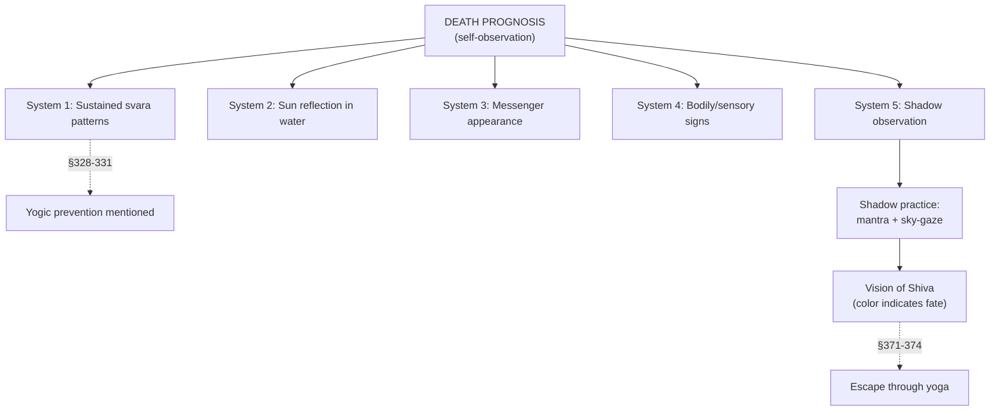

# Death Signs & Prognosis

[↩ Back to overview](overview.md)

> 📖 Verses 327–374

The death domain `§327-374` presents **five independent prognostic systems** for reading the proximity of death. Each system operates on different observational principles — sustained svara patterns, visual reflections in water, messenger appearances, bodily and sensory deterioration, and shadow distortions `[claim]`.

Most of these are self-observation methods (observing one's own svara patterns, reflections, bodily signs, and shadow). System 3 (messenger) is relational like [Disease](bhukti-disease-prognosis.md), observing external signs to predict a patient's death.

The death domain **transitions into yoga practice** at its end `§352-374`. After describing diagnostic methods, the text shifts to yogic interventions — first through the shadow-mantra-vision practice that can reveal Shiva, then through pranayama techniques for transcending death entirely. The final verses `§371-374` state that yoga, charity, pilgrimage, and virtuous conduct can escape death.

## System 1 — Sustained svara patterns

The text states that examining svara flow patterns at the **beginning of a month, fortnight, and year** reveals death proximity `§327`. When svaras lose their natural alternation rhythm and become locked in fixed patterns, death approaches `§332-335, §363-366` `[claim]`:

| Svara pattern | Remaining lifespan |
|---|---|
| **Same svara** flows continuously day and night | 3 years `§332` |
| **Solar svara** flows continuously for 2 days and nights | 2 years `§333` |
| **Same svara** flows continuously for 3 days and nights | 1 year `§334` |
| **Solar during day + lunar during night**, both continuously | 6 months `§335` |
| **Solar svara** flows continuously for 16 days | Death within remaining days of month `§363` |
| **Solar svara** remains active without break (context: shorter duration) | Fortnight `§364` |
| **Lunar svara** always active | 1 month `§366` |

The key indicator is **loss of alternation**. Healthy svara flow shifts between Ida and Pingala in regular cycles. When one nadi dominates continuously, the system recognizes this as a sign of approaching death.

### Yogic prevention embedded in diagnosis

The text embeds **yogic prevention methods** within this diagnostic system `§328-331`. After describing locked svara patterns as death signs, the text immediately states `[claim]`:

- "A person who guards his solar breath through Pranayama throughout the day and releases it after sunset lives for quite a long duration" `§329`
- "A person who prevents the solar and lunar svaras from flowing during the day and night, respectively, inevitably becomes a perfected yogi" `§331`

The text presents both natural svara rigidity (as death sign) and deliberate pranayama control (as life extension) within the same section.

## System 2 — Sun reflection in water

The practitioner observes **the sun's reflection in a bronze pot filled with water** `§336`. Distortions in the reflected image indicate remaining lifespan by direction and type of distortion `[claim]`:

| Reflection distortion | Remaining lifespan |
|---|---|
| Cut, missing, or fading **toward south** | 6 months |
| Cut, fading, or missing **toward west** | 3 months |
| Cut, fading, or missing **toward east** | 1 month |
| **Hole in the center** of reflection | 10 days |
| Sun appears **covered with smoke** | Same day (death imminent) |

The text specifies a **bronze vessel** and uses **directional orientation** (south = longer timeframe, west = medium, east = shortest before the immediate signs).

## System 3 — Messenger appearance

The text describes the **appearance of a messenger** who comes to ask about a patient's well-being `§337`. When someone matching these characteristics appears to inquire about a patient, the text states "believe that the patient is surrounded with death." This is a relational prognosis system like [Disease](bhukti-disease-prognosis.md), but focused specifically on terminal cases `[claim]`:

**Messenger characteristics indicating patient's death:**

| Feature | Indicators |
|---|---|
| **Clothing** | Red, saffron, or black colored |
| **Physical appearance** | Oily shaven head · broken teeth · body smeared with ash and embers |
| **Objects carried** | Rope/noose · skull · pestle |
| **Manner** | Gives complete answers to questions |
| **Timing** | Arrives at sunset |
| **Position** | Sits toward the Shoonya (closed) side |

**Patient's own behavior:** The text also states that if a person who has been sad suddenly becomes alright and starts getting excited, this is a sign of **delirium** indicating approaching death `§338`. This is observed in the patient themselves, not the messenger.

## System 4 — Bodily, sensory, and mental deterioration

This system has **two modes** — immediate present-state signs (death is near but no fixed timeline) and a **descending ladder** giving month-by-month countdowns as symptoms progress `§339-351, §367-370`.

### Immediate present-state signs (death imminent)

These signs indicate death is approaching, though the text doesn't assign fixed timelines `[claim]`:

- **Breath anomaly:** Cold exhalation from nose + hot exhalation from mouth (like fire) `§341`
- **Perceptual inversion:** Wicked words sound pleasant, pleasant words sound wicked `§340`
- **Visual inability:** Cannot see one's own tongue, sky, pole star, Milky Way, star Arundhati, Moon, Venus, star Agastya, or "route of gods" `§342`
- **Bodily changes:** Body getting cold, temperament becoming erratic `§339`
- **Elimination:** Urine, excreta, and wind expelled simultaneously (indicates weak prana) — 10 days `§365`

The text notes: "Now I will describe in detail the symptoms along with their effects in a person whose body is getting cold and his temperament getting erratic" `§339`. This frames the list as observable deterioration markers.

### Descending ladder (month-by-month countdown)

As symptoms intensify, the timeline shortens `§343-351, §367-370` `[claim]`:

| Sign | Remaining lifespan |
|---|---|
| Cannot see halo of rising sun/moon · fire appears without radiance | 11 months `§343` |
| Sees excreta, gold, or silver in pond (sleeping or awake) | 10 months `§344` |
| Sees gold and lamps as black · all beings appear disfigured | 9 months `§345` |
| Radical temperament shifts (fat↔thin, dark↔golden, brave↔timid, pious↔impious, calm↔fickle) | 8 months `§346` |
| Pain in palm or root of tongue · blood becomes blackish · extreme pain from sharp objects | 7 months `§347` |
| Three middle fingers don't bend · throat dry without sickness · asks stupid questions | 6 months `§348` |
| Cannot remember past acts | 5 months `§349` |
| Eyes devoid of light · both eyes feel pain | 4 months `§350` |
| No pain on pressing teeth, gums, or testicles | 3 months `§351` |
| Cannot see shadow of eyebrows | 9 days `§369` |
| No sound heard after closing ears | 7 days `§369` |
| Stars invisible | 5 days `§369` |
| Cannot see shining stars in eye-corners after pressing with fingertips | 10 days `§370` |
| Own nose invisible | 3 days `§369` |
| Own tongue invisible | 1 day `§369` |

The ladder progresses from **months** (perceptual and temperamental changes) to **days** (loss of basic sensory and bodily functions). The text uses symbolic language: "tongue, pole star, sky, Arundhati, Moon, Venus" are stated to symbolically represent actual bodily parts — "tongue, tip of nose, eyebrows, seven divine mothers" `§368`.

## System 5 — Shadow observation and the yogic turn

The **shadow system** observes one's own shadow under specific conditions `§352-362`. The text introduces this as "the ways to calculate the proximity or distance of death as per Shivagam (Shiva's Scripture)" `§352`.

### Shadow observation practice

**Setup:** Go alone to a lonely jungle, position yourself with **sun behind your back**, and single-mindedly concentrate on the **throat area of your shadow** `§353` `[claim]`.

**Shadow reading:** Which body parts are missing or distorted in the shadow indicates death timing `§359-362` `[claim]`:

| Shadow distortion | Reading |
|---|---|
| **Feet, ankles, or belly** missing | Lifespan has ended `§359` |
| **Left arm** missing | Spouse will die `§360` |
| **Right arm** missing | Brother/kin will die + self also expires `§360` |
| **Head** missing | 1 month `§361` |
| **Thighs or shoulders** missing | 8 days `§361` |
| **Entire shadow** absent | Already dead `§361` |
| **Lips or fingers** missing (morning observation) | Death in seconds `§362` |
| **Ears, shoulders, hands, face, backside, chest** missing | Half a second `§362` |
| **Head** missing + practitioner is "spooky" | 6 months `§362` |

### The yogic turn: Shadow practice becomes vision practice

**After establishing the shadow-reading diagnostic**, the text transforms the practice into a **visionary-yogic technique** `§353-358`:

**Extended practice:**
1. Stand with sun behind back in lonely place
2. Concentrate on throat area of shadow
3. Look toward the sky
4. Chant mantra **"Hrim Parabrahmane Namah"** 108 times `§354`

**Result:** Vision of Lord Shiva appears `§354` `[claim]`.

**Shiva's form is read by color** `§355-358` `[claim]`:

| Color of Shiva vision | Meaning |
|---|---|
| **White or crystal** (pure form) | Success · with 6 months practice → master of living beings · with 2 years → becomes Shiva himself (lord of creation, preservation, destruction) `§355` |
| **Dark** (in clear sky) | 6 months remaining lifespan `§357` |
| **Yellow** | Diseases coming `§358` |
| **Red** | Fear coming `§358` |
| **Blue** | Loss coming `§358` |
| **Multi-hued** | Siddhi (perfection/attainment) `§358` |

The text states: "With regular practice he becomes the knower of past, present and future and he experiences Paramananda (Supreme ecstasy). Nothing in this universe remains impossible for him" `§356`.

The same observational setup (shadow in lonely place) is used both for death-diagnosis and for this mantra-vision practice.

### Escaping death through yoga

The domain closes with explicit statements about **escaping the death predicted by these systems** `§371-374` `[claim]`:

- "One escapes death by holy pilgrimages, charity, penance, reciting mantras, meditation, yoga sadhana, and virtuous acts" `§371`
- The body must be preserved through yoga to remove all faults and ailments, otherwise they become incurable and kill `§373`
- "A person in whose heart originates and flows the eternal, unparalleled and moon-like illuminating knowledge of Swara yoga, does not have the fear of death even in his dream" `§374`

The text explicitly frames the body as the vehicle for dharma (righteous conduct), artha (wealth), kama (pleasure), and moksha (liberation), and therefore worthy of preservation through yogic practice `§373`.

## Why death matters

This domain presents **five independent diagnostic systems** using different observational data: breath patterns, visual reflections, messenger appearance, bodily deterioration, and shadow distortions. Four systems are self-observation (systems 1, 2, 4, 5), one is relational (system 3).

The shadow system (system 5) describes both a diagnostic shadow-reading practice and an extended mantra-vision practice that can produce visions of Shiva. The final verses `§371-374` state that yoga, pilgrimage, charity, and virtuous conduct can escape death, and that knowledge of svara yoga removes fear of death.

This domain is self-contained prognosis with embedded escape routes — diagnostic methods within the same section that also describes yogic interventions.
