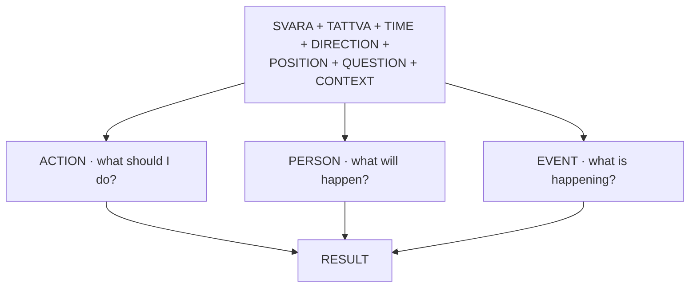
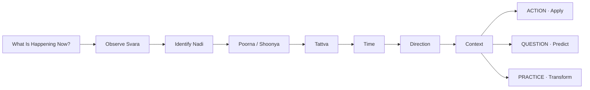

# Reading the World

[↩ Back to overview](overview.md)

> 📖 Verses 63–134, 179–191

**Bhukti** means "enjoyment" or "experience" — the worldly side of the system, where breath-reading is used to predict outcomes and guide action. The entire predictive methodology can be understood as **a single engine** that takes multiple inputs (svara, tattva, time, direction, position, question, context) and produces specific readings about what to do, what will happen, and what is occurring `§63-134, 179-191`.

Every domain-specific section that follows — war, conception, disease, death, weather — is this same engine fed with additional context-specific variables. The core mechanism remains constant.

## The base inputs

The prediction engine operates by combining several **base inputs**, each contributing a layer of meaning:

| Input | What to observe | How it affects the reading |
|---|---|---|
| **Active svara** | Which nadi flows (Ida/Pingala/Sushumna) | Ida = receptive/favorable for journeys; Pingala = forceful/favorable for confrontation; Sushumna = unsuitable for worldly action |
| **Tattva** | Which element dominates | Earth = stable; Water = favorable/immediate; Fire = dangerous; Air = unstable; Ether = void |
| **Time cycle** | Paksha, weekday, hour | Shukla paksha starts with Ida; Krishna paksha starts with Pingala; certain days pair with certain nadis for success |
| **Direction** | Where you're going | Ida governs East/North; Pingala governs West/South; match svara to direction |
| **Questioner** | Position, facing, height, appearance | Questioner from left during Ida = auspicious; from right during Pingala = auspicious; plus Poorna/Shoonya side |
| **Letter parity** | Count letters in the question | Even total = success; odd total = loss |

These inputs do not operate in isolation. The system requires **stacking** them to produce a specific reading.

## Time and calendar rules

The text gives detailed rules for how time cycles govern svara-flow `§63-75, 84-85`. **Why this matters:** These rules let you predict which svara *should* be flowing at any given moment, then check if reality matches. Mismatch = correction needed.

**Daily rhythm:**
- Each svara flows for ~60 minutes (2½ ghadis), alternating through the day `§63-66`
- Shukla paksha (waxing moon): Ida starts, flows for 3 days, then alternates
- Krishna paksha (waning moon): Pingala starts first
- **Practical use:** If the wrong svara flows at dawn, the text describes escalating consequences by hour — from mental disturbance (1st hour) to death (8th hour) `§84-85` `[claim]`. The practitioner can switch the svara deliberately using pranayama to avoid these outcomes.

**Weekly pattern:**
- **Ida-favorable days:** Monday, Wednesday, Thursday, Friday (especially during Shukla paksha)
- **Pingala-favorable days:** Sunday, Tuesday, Saturday (especially during Krishna paksha)
- **Practical use:** Schedule receptive activities (learning, nourishment, compromise) on Ida days; forceful activities (battle, confrontation, hard tasks) on Pingala days `§70-71` `[claim]`.

**Zodiac in 24 hours:**
- Even signs (Taurus, Cancer, Virgo, Scorpio, Capricorn, Pisces) = Ida/moon signs
- Odd signs (Aries, Gemini, Leo, Libra, Sagittarius, Aquarius) = Pingala/sun signs
- **Practical use:** The zodiac sign transiting at the moment adds another confirmation layer to the svara reading `§74-75` `[claim]`.

## Svara + Tattva — the core intersection

The most frequently used combination in the later verses is **svara + tattva**:

- **Svara alone** provides general tendency (Ida = receptive, Pingala = forceful) and directional correspondence (Ida = East/North, Pingala = West/South)
- **Tattva alone** provides elemental tendency (Earth = stable/delayed profit, Water = immediate success, Fire = danger/loss, Air = destruction, Ether = void/failure)
- **Svara + tattva together** produce specific operational meaning (e.g., Ida + Water = journey success; Pingala + Fire = battle victory; any svara + Ether = all worldly actions fail)
- **+ context** (war, health, conception, weather) determines the final interpretation (e.g., Fire during war = injury; Fire during disease = fever; Fire during cosmic forecast = drought)

This intersection is the predictive engine's central mechanism. No single variable suffices — meaning emerges from the combination.

## The observation loop

The text implies an **operational procedure** for applying the system in real time:

The practitioner begins by observing which svara is flowing, identifies the nadi (Ida/Pingala/Sushumna), determines Poorna or Shoonya, reads the tattva, notes the time and direction, and applies the appropriate contextual interpretation. The system is **relational, not just introspective** — the questioner's position, facing, and appearance become part of the reading.

## Domain-specific applications

The following sections are not separate systems — they are **this same engine applied to specific contexts**, each adding domain-relevant variables:

- [War](bhukti-combat.md) — role (invader/defender), direction, tattva, injury sites
- [Conception & Enchantment](bhukti-conception.md) — sex-of-child, conception timing, enchantment methods
- [Disease](bhukti-disease-prognosis.md) — cause by tattva, prognosis factors
- [Death](bhukti-lifespan-prognosis.md) — five prognostic systems (svara pattern, reflection, messenger, bodily signs, shadow)
- [Cosmic Forecast](bhukti-weather-agriculture.md) — yearly tattva predictions, weather, harvest

The engine remains constant; the context changes.

## Why the bhukti engine matters

This is the hinge between the foundational concepts (Tattvas, Prana, Nadis, Svara) and the applied domains (War, Conception, Disease, Death, Cosmic Forecast). Everything before this taught you *what* the elements are. This section teaches you *how to use them*.

The bhukti engine shows that the text is not just cataloging mystical concepts — it's building an **operational decision-making system**. When should I travel? Which direction? Should I fight or compromise? Will this person recover? The text answers these questions by teaching you to read the layered pattern of breath at the moment the question arises.

The contrast with the mukti path ([Yoga path](mukti-yoga.md)) is stark: bhukti uses the system to *predict and navigate* the world; mukti uses the system to *transcend* the world. Same variables, opposite objectives. But you cannot practice mukti without understanding bhukti — you must first learn to observe the flow before you can learn to reverse it.

This is the application layer — where observation becomes prediction, and prediction guides action.
