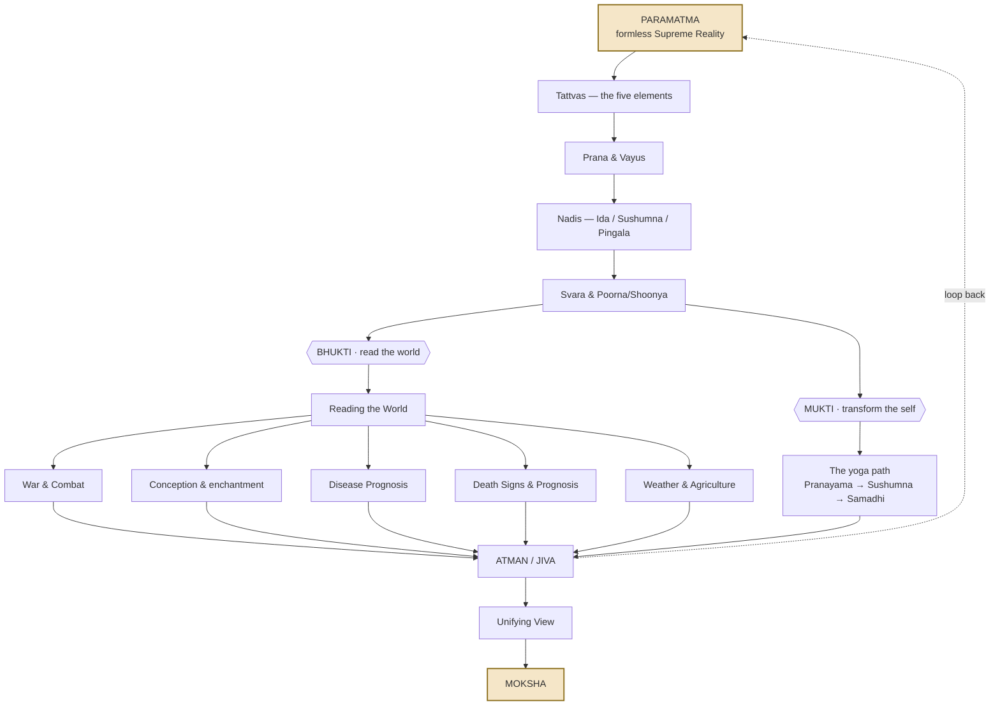

# Swarodaya Shastra — System Architecture

This page shows the **complete 396-verse system as one layered architecture**. Each box links to a detailed page. Nothing is hidden — the detail lives in those linked pages.

## How to read this diagram

- **Vertical flow (spine):** Paramatma → Tattvas → Prana → Nadis → Svara — the emanation sequence from formless source to observable breath
- **Horizontal split (branches):** Svara branches into Bhukti (prediction) and Mukti (transformation) — same knowledge, two applications
- **Return loop:** Both paths lead back to Atman/Jiva, unify in synthesis, and ultimately return to Moksha/Paramatma

**Visual markers:**
- Solid arrows (→) = direct emanation or flow
- Dashed arrows (⇢) = conceptual loops
- Diamonds {{}} = decision/branching points
- Boxes with yellow background = source and destination (beginning/end)

**Content markers in linked pages:**
- `[claim]` = traditional scriptural assertion, not empirically verified
- `§X-Y` = verse range referenced

---

## The Architecture Explained

### **The Spine — Foundation Layers**

The text describes a **cascading emanation** from the formless supreme reality down to observable breath:

1. **Paramatma** — unchanging, formless source (`§4-5`)
2. **Tattvas** — five elements: space → air → fire → water → earth (`§6-8`)
3. **Prana & Vayus** — ten life-energies moving through the body (`§43-48`)
4. **Nadis** — 72,000 channels; three primary: Ida (moon/left), Pingala (sun/right), Sushumna (center) (`§32-42`)
5. **Svara** — the observable breath in nostrils, showing which element/nadi is active (`§72, 155`)

Each layer is a **refinement of the previous**. Cosmic elements → bodily energies → channel networks → measurable breath flow.

### **The Split — Two Applications**

Once you can **read the active element in your breath**, the text offers two paths:

**Bhukti (भुक्ति) — Reading the World**

Prediction engine: which nostril is active + which element is flowing → determines outcome of actions

- **Combat** — timing attacks, reading enemy approach, victory conditions
- **Conception** — gender prediction, timing intercourse, characteristics of child
- **Disease** — prognosis from questioner's breath, survival/death timelines
- **Lifespan** — five independent death-sign systems
- **Weather & Agriculture** — seasonal predictions, rainfall, harvest timing

**Mukti (मुक्ति) — Transforming the Self**

Yoga path: manipulate breath to awaken Sushumna → transcend duality → liberation

- Pranayama techniques to balance Ida/Pingala
- Suspending breath in Sushumna dissolves tattwas
- Progression: breath control → samadhi → moksha

### **The Return — Synthesis**

Both paths lead to the same realization of **Atman/Jiva** (individual soul within cosmic self), explored through:

- **Unifying View** — eight notable characteristics of how the text works
- **Moksha** — final liberation, return to Paramatma (the loop closes)

---

## Page Index by Section

### **The spine**
1. [Tattvas — the five elements](tattvas.md)
2. [Prana & Vayus](prana-vayus.md)
3. [Nadis — Ida / Sushumna / Pingala](nadis.md)
4. [Svara & Poorna/Shoonya](svara.md)

### **Bhukti — reading the world (prediction)**

5. [Reading the World](bhukti-reading-the-world.md)
6. [War & Combat](bhukti-combat.md)
7. [Conception & enchantment](bhukti-conception.md)
8. [Disease Prognosis](bhukti-disease-prognosis.md)
9. [Death Signs & Prognosis](bhukti-lifespan-prognosis.md)
10. [Weather & Agriculture](bhukti-weather-agriculture.md)

### **Mukti — transforming the self (yoga)**

11. [The yoga path](mukti-yoga.md)

### **Unifying**

12. [Unifying View](unifying-view.md)

---

## The Core Insight

> **COSMIC ↕ ELEMENTAL ↕ PRANIC ↕ NADI ↕ SVARA ↕ OBSERVABLE STATE**

What happens at the cosmic level manifests through elements, flows as prana through nadis, and becomes **readable in your breath**. The text claims this correspondence is precise and bidirectional:

- **Read the breath** → predict/diagnose external events (Bhukti)
- **Master the breath** → dissolve internal conditioning → liberation (Mukti)

Both applications rest on the same foundation: **the active element in your nostril at any moment carries information about, and influence over, the corresponding level of reality**.
