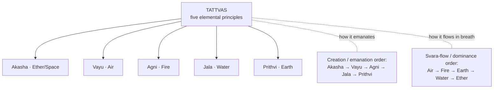

# Tattvas — the five elements

[↩ Back to overview](overview.md)

> 📖 Verses 1–9, 146–214

**Tattva** means "thatness" or "essential principle" — the text uses it to name the five elemental building blocks of both cosmos and body.

## From the formless to the five

Parvati asks Shiva to explain the **tattvas**, the root principles from which the world is made `§4-5`. Shiva answers with a simple chain: the formless **Paramatma** gives rise to **Akasha** (space/ether); from space comes **Vayu** (air); from air comes **Agni** (fire); from fire comes **Jala** (water); and from water comes **Prithvi** (earth) `§6-7`. The text then makes the key move: the cosmos is created from these five, sustained by them, and dissolved back into them `§8`; the human body is also made from the same five, though their subtle movement is perceived only by the yogi `§9`.

This establishes the foundation: the elements are not only cosmic principles but also bodily principles, and the **breath is where the two meet**. Everything in the later sections — predictions about war, health, weather, conception, and the path to liberation — depends on identifying which element is active in the breath at a given moment.

## Two sequences, two contexts

The text describes the tattvas in **two different orderings**, and distinguishing them is essential for correctly identifying which element is active in the breath at a given moment.

| Sequence | Order | Context | How to use it |
|---|---|---|---|
| **Creation order** | Akasha → Vayu → Agni → Jala → Prithvi | Cosmology: how the world unfolds from the formless into matter `§6-8` | Use this when the text is explaining origin, preservation, and dissolution. |
| **Breath-flow order** | Vayu → Agni → Prithvi → Jala → Akasha | Observation: how elements arise within a svara cycle `§72` | Use this when reading the active element in the nostril. |

Within the nostril each element has a recognizable place and motion: air brushes the sides, fire rises upward, water moves downward, earth holds the centre, and ether pervades both nostrils `§72, 155, 160, 165-168`. So "the sequence of the tattvas" means one thing in cosmology and another in breath-reading.

## What an element means in this system

The five terms — earth, water, fire, air, ether — do not function here as material substances in a chemical sense. Each tattva is at once a cosmic principle, a bodily principle, and a quality known through the felt character of the breath `§9, 26`. The text states that until a person grasps the tattvas, they remain caught in names and forms `§26`.

The same element does not carry a single fixed meaning. Earth in a question about farming, earth in a question about battle, and earth at the moment of conception point to different outcomes. The element supplies a tendency; the context determines the result. Per-domain outcomes are covered in [War & Combat](bhukti-combat.md), [Conception & Enchantment](bhukti-conception.md), and [Weather & Agriculture](bhukti-weather-agriculture.md).

## General tendencies

Each tattva carries a set of characteristic tendencies, though the text emphasizes that outcomes vary by context `[claim]`:

| Tattva | Tendencies |
|---|---|
| **Earth** (Prithvi) | stability · prosperity · food/agriculture · balanced results |
| **Water** (Jala) | nourishment · rain · abundance · favorable · victory `[claim]` |
| **Fire** (Agni) | force · conflict · danger · famine · injury/loss `[claim]` |
| **Air** (Vayu) | instability · calamity · scanty rain · disaster `[claim]` |
| **Ether** (Akasha) | void · scarcity · loss in worldly matters — the gateway to Sushumna and yoga |

The text repeatedly cautions that the same tattva yields different outcomes depending on the domain of the question — whether war, conception, weather, or another context. Specific per-domain outcomes are detailed in [War & Combat](bhukti-combat.md), [Conception & Enchantment](bhukti-conception.md), and [Weather & Agriculture](bhukti-weather-agriculture.md).

## The eightfold science of tattvas

Before giving the details, the text frames the study of the tattvas as an **eightfold science** `§146-149`: (1) the number of elements, (2) their sandhis (the junctions where one breath passes into the next), (3) the signs by which a svara is recognized, (4) the place of the svara, (5) the colour and form of its seed-syllable (beeja), (6) its prana, (7) its taste, and (8) the signs of the tattva's movement.

The tables that follow fill in this framework.

## The full signature of each element

Read together, the verses give every tattva a complete sensory and spatial signature — colour, shape, taste, breath-length, seat in the body, and seed-mantra. The "shape" is described as the form that appears when breath is exhaled onto a mirror `§153-154`.

| Element | Colour | Shape | Taste | Breath length | Body seat | Beeja |
|---|---|---|---|---|---|---|
| **Earth** | yellow | square | sweet | 12 angula | knees | **Lam** |
| **Water** | white | crescent | astringent | 16 angula | feet | **Vam** |
| **Fire** | red | triangle | pungent | 4 angula | shoulders | **Ram** |
| **Air** | dark blue | circle | sour | 8 angula | navel root | **Yam** |
| **Ether** | multi-hued | formless | bitter | omnipresent | head | **Ham** |

`§154, 157, 163-174`

### Seed-mantras and their powers

Each element has a **seed-mantra (beeja)** whose meditation, according to the text, grants a specific power `§210-214` `[claim]`:

- **Lam** (earth, visualized on a golden square) → lightness of body `§210`
- **Vam** (water, on a white crescent) → ability to bear hunger and thirst, and to remain long in water `§211`
- **Ram** (fire, on a red triangle) → power to digest and consume greatly, and to withstand intense heat `§212`
- **Yam** (air, on a dark circle) → the power to move through the sky `§213`
- **Ham** (ether, formless and multi-hued) → omniscience and the eight great siddhis `§214`

### How to observe and interpret each element

Beyond their sensory signatures, the elements have characteristic **patterns of movement and predictive meanings** that the practitioner learns to read.

**Breath motion:** Earth flows to the centre (downward to the chin) · Water downward · Fire upward and circular · Air slant/oblique · Ether pervades both. `§155, 160, 165-168`

**Predictive effect:** Earth and Water tend toward success (Water brings immediate results, Earth brings delayed results) · Fire points to death · Air to loss and destruction · Ether renders worldly action fruitless but is the element of moksha and yoga. `§163-164, 175` `[claim]`

**Element directions:** Earth governs East–West, Fire the South, Air the North, Ether the centre; a variant assigns East to Earth, West to Water, South to Fire, and North to Air. `§176, 191` `[claim]`

## The elements made flesh

The tattvas are not described as abstract principles only. The text specifies which bodily tissues and functions each element governs, and gives their proportions within the human body `§192-200`:

| Element | Bodily tissues / functions | Proportion | # attributes |
|---|---|---|---|
| **Earth** | bones, flesh, skin, nadis, hair | 50 palas | 5 |
| **Water** | semen/ova, blood, marrow, urine, saliva | 40 palas | 4 |
| **Fire** | hunger, thirst, sleep, lustre, lethargy | 30 palas | 3 |
| **Air** | running, walking, secretion, contraction, expansion | 20 palas | 2 |
| **Ether** | attachment, jealousy, shyness, fear, passion | 10 palas | 1 |

*Pala: the source text notes it as a unit of time (150 palas = 1 hour), though traditionally pala is a weight measure. The key is the descending ratio 50:40:30:20:10, showing earth as most substantial, ether as subtlest.* 

*# attributes: the text states "Earth has five attributes, water has four, fire has three, air has two, and ether one" `§200` without defining what these numbered qualities are — likely referring to the fundamental properties each element possesses in classical theory, with earth being most complex and ether most unified.* `§192-200`

Earth builds the solids, water the fluids, fire the metabolic processes, air the movements, and ether the inner states. The proportions descend from 50 to 10 palas, and the attribute-counts follow the same ladder — 5, 4, 3, 2, 1.

## Elements, planets, and stars

The elements extend into the celestial sphere. The text assigns planets to elements differently depending on whether the **solar** or **lunar** svara is active `§183-185`:

| Active svara | Element | Planetary pointer |
|---|---|---|
| **Solar / Pingala** | Fire | Mars |
| **Solar / Pingala** | Earth | Sun |
| **Solar / Pingala** | Water | Saturn |
| **Solar / Pingala** | Air | Rahu |
| **Lunar / Ida** | Water | Moon |
| **Lunar / Ida** | Earth | Mercury |
| **Lunar / Ida** | Air | Jupiter |
| **Lunar / Ida** | Fire | Venus |

>The text says these are the "nine planets" `§184`, but the listed mapping explicitly names only eight planetary pointers. **Ketu is not separately assigned** in these verses; the closest related node is Rahu in the solar-air position `§183, 186`.

Each element also governs a set of **nakshatras** (lunar mansions) `§202-205`, though the specific lists are given in the verses.

This is the context for the often-quoted statement that **astrology without knowledge of the svara is "a house without an owner"** `§17` — the elemental breath gives life to the star-lore.

## Why the tattvas matter

Everything that follows builds on this foundation. When you read [Reading the World](bhukti-reading-the-world.md), every prediction about timing, direction, and outcome begins by identifying the active tattva. When you read [War & Combat](bhukti-combat.md), [Conception & Enchantment](bhukti-conception.md), or [Disease Prognosis](bhukti-disease-prognosis.md), the tattva determines the result. When you read [The Yoga Path (Mukti)](mukti-yoga.md), the dissolution of the tattvas into Sushumna is the path to liberation. This page is the alphabet; those pages are the sentences.
